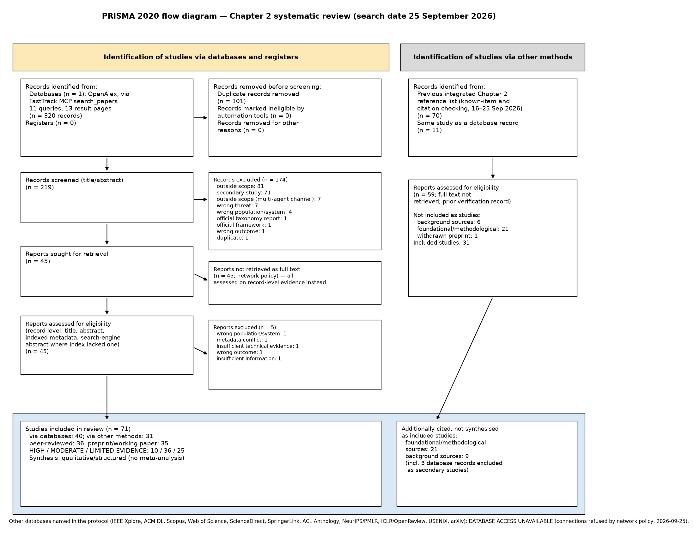

# CHAPTER TWO
# LITERATURE REVIEW: A SYSTEMATIC REVIEW OF RUNTIME SECURITY FOR TOOL-USING AI AGENTS

## 2.1 Introduction

Large language model (LLM) agents no longer only produce text for a human reader. They break tasks into steps, call external tools with arguments they generate themselves, read the results of those calls, and act again on what they read. When such an agent operates on financial tools, a single proposed tool call can:

- initiate a transfer;
- change a payee;
- modify a scheduled payment;
- send customer data to an external recipient.

The security question therefore shifts from what a model *says* to what an agent *does*. More precisely, it shifts to the moment at which a proposed action leaves the agent and takes effect in its environment.

This chapter reviews the literature on protecting such an agent at runtime. Earlier versions of the chapter were structured narrative reviews. This version is a **systematic literature review with qualitative, structured evidence synthesis**. It follows PRISMA 2020 for reporting and PRISMA-S for the search. The methodology in Section 2.2 records what was actually done: which sources were searched and which could not be accessed, the exact search strings, the screening decisions, the quality appraisal and the extraction. Where a step of the systematic-review process could not be carried out in full, the limitation is stated rather than concealed. No meta-analysis is attempted. The included studies differ in architecture, threat model, benchmark, metric and intervention, so their quantitative results cannot be pooled (Section 2.2.8).

The review is used to build an argument in eight steps:

1. agents create security risks that differ from those of conventional LLM use;
2. prior research has characterized the main threats and proposed many defenses;
3. those defenses differ in *where* they intervene;
4. they also differ in *what* they observe;
5. some capabilities are now well addressed;
6. others remain fragmented or weakly evidenced;
7. these patterns locate the Runtime Evaluation and Mitigation (REM) framework studied in this thesis;
8. the financial setting raises the stakes of each of these questions.

The research gap at the end of the chapter was derived only after screening, extraction and synthesis were complete. Section 2.13.1 assesses five candidate gaps against the evidence and retains, narrows or rejects each.

**Chapter structure.**

- Section 2.2 reports the review methodology.
- Section 2.3 explains why agent architecture changes the security problem.
- Sections 2.4 and 2.5 synthesize the evidence on threats, benchmarks and threat models.
- Section 2.6 organizes defenses by where they intervene.
- Section 2.7 examines runtime monitoring, behavioral evidence and provenance.
- Section 2.8 reviews the statistical and algorithmic foundations on which a runtime decision layer depends. The detailed REM specification is left to Chapter 3.
- Section 2.9 examines how runtime systems decide and mitigate.
- Section 2.10 separates financial-agent evidence from general agent-security evidence.
- Sections 2.11 and 2.12 compare the evidence across studies and synthesize it by theme.
- Section 2.13 states the research gap, positions REM, and records the limitations of the review.
- Section 2.14 summarizes the chapter.

---

## 2.2 Systematic Review Methodology

### 2.2.1 Review objectives and research questions

**Derivation.** The review questions are derived from the approved thesis direction and introduce no new thesis research questions. The approved proposal states three objectives:

- **O1:** design a REM framework for financial AI agents' and task automation agents' security;
- **O2:** evaluate the framework against adversarial attacks;
- **O3:** compare performance with existing security approaches (Chapter 3, Section 3.1.2).

The proposal does not state research questions. Chapter 3 (Section 3.1.3) derives four questions, RQ1–RQ4, from these objectives. They concern estimation, decision, mitigation and cost, and component contribution, and they remain marked as proposed ([PD]) pending supervisor confirmation. This inconsistency between the proposal and the chapters is recorded here as found. It is not resolved.

**Review questions.** The review is designed to supply the literature basis that O1–O3, and RQ1–RQ4 once confirmed, require. It asks five review questions (SRQ). These define the scope of this chapter only; they are not thesis research questions.

| Review question | Wording | Serves |
|---|---|---|
| SRQ1 | What security threats affect tool-using AI agents, particularly those operating through external tools and multi-step execution? | O1 (threat model); O2 (attack scenarios) |
| SRQ2 | What defensive approaches have been proposed to detect, monitor, evaluate and mitigate these threats at runtime? | O1 (design space); O3 (comparators) |
| SRQ3 | What behavioral, provenance, probabilistic, sequential and decision-theoretic techniques are used? | O1; RQ1, RQ2 and RQ4 [PD] |
| SRQ4 | What evidence exists for these approaches in financial or financially consequential agent settings? | O1 (financial scope); O2 |
| SRQ5 | What limitations and evidence gaps remain that motivate the REM framework? | Research gap (Section 2.13) |

### 2.2.2 Information sources

The review protocol named eleven preferred sources:

- IEEE Xplore;
- ACM Digital Library;
- Scopus or Web of Science;
- ScienceDirect;
- SpringerLink;
- ACL Anthology;
- NeurIPS and PMLR proceedings;
- ICLR proceedings;
- USENIX;
- arXiv, as a supplementary source.

These sources were not directly searchable from the review environment. Direct access was attempted on 25 September 2026, and the network policy refused every connection. The connection log is retained with the search record. An attempt to use Elicit, a second scholarly index, also failed: the account's plan does not include API access. Each of these sources is therefore recorded as **DATABASE ACCESS UNAVAILABLE** (`CHAPTER2_SYSTEMATIC_SEARCH_STRATEGY.md`, §1).

**Source actually searched.** The one bibliographic database searched was **OpenAlex**, through a literature-search tool that queries its index of about 250 million records. OpenAlex indexes the proceedings and journals of the publishers listed above, as well as arXiv. Studies from those venues could therefore be retrieved, but only through OpenAlex's index and relevance ranking, not through each library's own search interface. The review accordingly does **not** claim to have searched the named digital libraries.

**Other methods.** A second, non-database stream was used, as PRISMA 2020 allows. It consists of the 70 sources in the reference list of the previous integrated version of this chapter. That list was assembled by known-item searching of the thesis corpus and backward citation checking, and it was verified between 16 and 25 September 2026. Crossref was used only to verify metadata, never to identify records.

### 2.2.3 Search strategy

**Concept blocks.** The protocol defines three concept blocks and a financial block:

- **A — Agents:** "LLM agent", "AI agent", "language model agent", "tool-using agent", "autonomous agent";
- **B — Security:** "security", "prompt injection", "indirect prompt injection", "tool misuse", "agent safety", "goal hijacking", "memory poisoning", "action manipulation";
- **C — Runtime, behavior and mitigation:** "runtime monitoring", "runtime interception", "behavioral monitoring", "trajectory", "tool use", "provenance", "anomaly detection", "mitigation", "guardrail", "policy enforcement";
- **Financial:** "financial agent", "banking agent", "financial AI agent", "financial tool", "financial transaction", combined with security, prompt-injection, tool-misuse, runtime, safety or mitigation terms.

**Database variant.** The OpenAlex interface available to the review is lexical and relevance-ranked, and it does not accept Boolean operators. The blocks were therefore translated into eleven free-text queries, each combining at least one term from blocks A, B and C. Two queries (Q7, Q8) carried the financial block. The exact strings are reproduced in Table 2.1. Each query was restricted to publication years 2019–2026. Page 2 was also retrieved for the two queries with the highest page-1 yield of eligible records (Q1, Q2), giving 13 result pages and 320 records in total.

The final search date was **25 September 2026**, and every counted search ran on that date. The raw output of every query is stored unchanged, and a script recomputes all counts from it (`chapter2/slr/`).

**Table 2.1. Database searches (OpenAlex; 25 September 2026; years 2019–2026)**

| Query | Exact search string | Blocks | Records screened | Index estimate |
|---|---|---|---:|---:|
| Q1 (pages 1–2) | LLM agent indirect prompt injection runtime defense tool use | A+B+C | 50 | 1,366 |
| Q2 (pages 1–2) | LLM agent security runtime monitoring guardrail tool call | A+B+C | 49 | 1,123 |
| Q3 | tool-using language model agent behavioral trajectory monitoring anomaly detection safety | A+B+C | 24 | 5,572 |
| Q4 | LLM agent provenance goal alignment tool call misalignment detection | A+B+C | 25 | 484 |
| Q5 | prompt injection benchmark tool-integrated LLM agents attacks and defenses evaluation | A+B+C | 24 | 2,950 |
| Q6 | LLM agent memory poisoning goal hijacking multi-step attack | A+B | 24 | 579 |
| Q7 | financial LLM agent security prompt injection tool misuse | Fin+A+B+C | 24 | 1,368 |
| Q8 | banking agent safety benchmark financial transaction LLM agent | Fin+A+B | 25 | 536 |
| Q9 | calibrated risk score intervention policy LLM agent runtime safety | A+B+C | 25 | 880 |
| Q10 | privilege control policy enforcement LLM agents tool calls prompt injection | A+B+C | 25 | 1,380 |
| Q11 | pre-execution action validation guardrail autonomous LLM agent unsafe actions | A+B+C | 25 | 744 |
| **Total** | | | **320** | — |

**Retrieval cap.** Only the relevance-ranked top of each query was screened: 24–25 records per page, the maximum the tool returned. The index estimates show that far more records matched the query terms. This cap is a deliberate feasibility decision, consistent with the protocol's instruction not to screen thousands of records manually. It is also the review's largest search limitation (Section 2.13.4). The stopping rule, the tool's handling of each string, and a one-off pilot probe that is not counted are all documented in the search record.

### 2.2.4 Eligibility criteria

A study was included when it satisfied all six criteria.

- **I1 — Population.** The study addresses AI or LLM agents, tool-using agents or agentic systems. *Operational clarification, fixed before eligibility assessment:* LLM-integrated applications that ingest untrusted third-party content were counted as satisfying I1 when the attack or defense applies to the agent's input channel, because indirect injection against agents originates in that setting. Studies whose threat is specific to inter-agent communication in multi-agent systems were treated as outside the review population, which is single tool-using agents.
- **I2 — Problem.** The study addresses a security, safety, robustness, monitoring or misuse problem.
- **I3 — Contribution.** The study contains a substantive technical method, benchmark, empirical evaluation or analytical contribution. Position papers qualified only if they supplied a formal framework, a system design, or an empirical analysis of primary data. Argument-only position papers did not qualify.
- **I4 — Relevance.** The study directly informs at least one REM-relevant dimension: input or context security, runtime monitoring, behavioral analysis, action or tool monitoring, provenance, decision, mitigation, or financial execution security.
- **I5 — Extractability.** The study provides enough information to extract its relevant contribution.
- **I6 — Period.** The study was published between January 2019 and 25 September 2026, or it is a necessary **FOUNDATIONAL SOURCE**.

**Exclusion labels.** Records were excluded with a standard label:

- wrong population/system;
- wrong threat;
- wrong outcome;
- insufficient technical evidence;
- duplicate;
- outside scope;
- inaccessible full text or insufficient information;
- secondary study (survey, review, SoK or tutorial);
- metadata conflict;
- withdrawn.

**Secondary studies and methodological sources.** Secondary studies were not synthesized as primary evidence. Three of them, identified by the database search, are cited only as background: two definitional surveys and a finance SoK.

Methodological sources that do not concern agents also fail I1. These are the statistical, calibration, change-detection, decision-theoretic and anomaly-detection sources, and they were admitted under the second clause of I6 as **FOUNDATIONAL SOURCES**. Those published within the review period are labelled methodological sources. They support Section 2.8 and do not count as included studies.

The prior-art studies named in the protocol were given no special route. Each of AgentTrust, NEXUS, ProvenanceGuard, FinHarness, AgentDojo, AgentHarm, Progent, AgentSpec, ShieldAgent, Task Shield, MELON, CaMeL and LlamaFirewall passed through the same criteria.

### 2.2.5 Study selection

Selection had two stages, both carried out by a single reviewer.

1. **Title and abstract screening** of the 219 records that remained after automated deduplication. Records counted as duplicates when they shared a DOI or their normalized titles matched; this removed 101 of the 320 hits.
2. **Eligibility assessment** of the records that passed screening.

**Full texts were not retrieved.** The network policy that blocked the databases also blocked publisher and preprint servers. Every report sought for retrieval was therefore assessed for eligibility on **record-level evidence**: title, abstract, indexed metadata, Crossref metadata and, for two records without an indexed abstract (VIGIL and R-Judge), the abstract text returned by a web search. This departure from standard practice is shown explicitly in the PRISMA flow diagram (Figure 2.1).

**Other-methods stream.** The 70 other-methods records were assessed in the same way against the prior verification record. Eleven were the same study as a database record and were counted once.

**Screening log.** Every decision, with its reason, is in `CHAPTER2_SCREENING_LOG.csv`.

**Table 2.2. Study selection (counts computed from the screening log)**

| Stage | Databases (OpenAlex) | Other methods |
|---|---:|---:|
| Records identified | 320 | 70 |
| Duplicates removed before screening | 101 | 11 (same study as a database record) |
| Records screened (title/abstract) | 219 | — |
| Records excluded at screening | 174 | — |
| Reports sought / full text not retrieved | 45 / 45 | 59 / 59 |
| Reports assessed for eligibility (record level) | 45 | 59 |
| Reports excluded at eligibility | 5 | 28 (6 background, 21 foundational/methodological, 1 withdrawn) |
| **Studies included** | **40** | **31** |
| **Total included studies** | **71** | |

**Exclusions at screening.** The 174 records excluded at screening break down as follows:

- 81 outside scope;
- 71 secondary studies;
- 7 multi-agent-channel studies;
- 7 wrong threat;
- 4 wrong population;
- 2 official reports;
- 1 wrong outcome;
- 1 duplicate.

**Exclusions at eligibility.** Five records passed screening but were excluded at eligibility:

- a retrieval-augmented question-answering system without tool actions (wrong population/system);
- a record whose index metadata attached AgentDojo's DOI and authors to an unrelated abstract (metadata conflict);
- an argument-only position paper (insufficient technical evidence);
- an observability taxonomy without a security evaluation (wrong outcome);
- a record without an abstract (insufficient information).

**Recall of the database search.** Of the thirteen named prior-art studies, the database search retrieved three: Task Shield, LlamaFirewall and, with corrupted metadata, AgentDojo. The other ten entered through the other-methods stream. This low recall of known relevant studies is itself a finding about the search, discussed in Section 2.13.4.

**Figure 2.1.** PRISMA 2020 flow diagram. Counts are computed by script from the stored search output and the screening log.

### 2.2.6 Quality appraisal

Every included study was appraised against the protocol's ten-item checklist. The items ask whether the study reports:

- Q1 — its objective;
- Q2 — its threat model;
- Q3 — its method;
- Q4 — reproducibility;
- Q5 — its dataset or benchmark;
- Q6 — its metrics;
- Q7 — its comparators;
- Q8 — its limitations;
- Q9 — evidence for its quantitative claims;
- Q10 — peer-review status.

**Codes.** Each item is coded Yes, No, Not Verified or Not Applicable. Q10 also has a "preprint clearly labelled" code.

**Categories.** No numeric score is computed. A fixed, published rule assigns each study to a category:

- **HIGH EVIDENCE:** peer reviewed, with benchmark, figures and comparator all reported;
- **MODERATE EVIDENCE:** quantitative results in a peer-reviewed or clearly labelled preprint record, or a peer-reviewed evaluation without verifiable figures;
- **LIMITED EVIDENCE:** everything else.

**Override.** One override is applied and documented. FinHarness is set to LIMITED EVIDENCE because all of its figures were measured on a withdrawn benchmark.

**Results.** Of the 71 included studies:

- 10 are HIGH EVIDENCE, 36 MODERATE EVIDENCE and 25 LIMITED EVIDENCE;
- 36 are peer reviewed and 35 are preprints or working papers;
- 62 are FULLY VERIFIED and 9 PARTIALLY VERIFIED. The metadata and cited contribution of each study were checked against its record. PARTIALLY VERIFIED means that some cited detail rests only on search-engine text.

**What the categories measure.** Because full texts were unavailable, the categories measure **how much of each study's evidence could be verified from its record**, not the study's intrinsic quality (`CHAPTER2_QUALITY_APPRAISAL.md`). Items that depend on the full text (Q4 reproducibility, Q7 comparators, Q8 limitations) are most often Not Verified.

**How the categories are used.** They qualify how strongly a finding is worded in the synthesis. They were not used to exclude studies.

### 2.2.7 Data extraction

A single reviewer extracted 21 fields per included study into `CHAPTER2_SYSTEMATIC_EVIDENCE_MATRIX.csv`:

- study, year and venue;
- agent type;
- threat and attack entry point;
- whether the study operates at runtime;
- context, behavioral, tool/action, multi-step and provenance evidence;
- decision mechanism and mitigation;
- benchmark;
- financial context;
- metrics;
- main result and limitation;
- evidence level.

**Coding values.** Each property is coded **Yes**, **No**, **Not Reported**, **Not Applicable** or **Not Verified**. "Yes" is never entered for a property that is merely absent from the record.

**Definitions and verification.** Financial context is coded "Yes" only where the study's setting is primarily financial. A general benchmark that contains one financial scenario is coded "No", with a note. Every included study also carries a verification label, FULLY VERIFIED or PARTIALLY VERIFIED, following the thesis rule that search-engine text cannot settle a primary claim.

**Numbers.** Every number reported in this chapter is taken from the primary report of the study concerned, as recorded in the matrix.

### 2.2.8 Evidence synthesis

**No meta-analysis.** Quantitative pooling was not possible. The included studies use different agents, attack sets, benchmarks, success definitions and metrics, and many report only author-selected configurations. A pooled estimate would have no interpretable common parameter.

**Structured synthesis.** The synthesis is therefore qualitative and structured. Evidence is organized into eleven themes:

1. threats;
2. entry points;
3. observation granularity;
4. runtime intervention;
5. behavioral and trajectory evidence;
6. provenance and goal–action consistency;
7. statistical and algorithmic methods;
8. decision and consequence handling;
9. mitigation;
10. financial-agent evidence;
11. evaluation quality.

**Five questions per theme.** For each theme the synthesis asks:

- what the literature establishes;
- what remains uncertain;
- what is under-evaluated;
- what differs across studies;
- what this implies for REM.

These syntheses appear at the end of the relevant sections and are consolidated in Section 2.12 (Table 2.10). Conflicting findings are presented side by side rather than resolved in favor of either side.

**How results are worded.** Author-reported figures are stated as such, with their setting, and are not compared across studies as if they were measured on a common scale. Claims that rest on a single study are worded as single-study findings.

---

## 2.3 AI Agents and Emerging Security Risks

### 2.3.1 From language models to agents

In the survey literature, an LLM-based autonomous agent is a system in which a language model acts as the controller for perception, reasoning, planning and action in pursuit of a task, supported by memory and tool-use modules (L. Wang et al., 2024; background source). Two capability developments made this architecture practical:

- **ReAct** interleaves reasoning with action. The model generates a thought, selects an action, receives the environment's observation, and conditions its next step on that observation (Yao et al., 2023).
- **Toolformer** showed that a language model can learn which application programming interfaces to call, when to call them, and with what arguments (Schick et al., 2023).

Both are capability papers. They fail criterion I2 and are cited only as background. Together they describe the execution pattern that most agent frameworks still follow: a loop of reasoning, tool invocation and observation, which continues until the model judges the task complete.

### 2.3.2 Why agent architecture changes the security problem

The loop that makes agents useful also creates their attack surface. Three structural properties distinguish agent security from the security of a stand-alone model:

- **Several input channels of different trustworthiness.** The system prompt, the user's request, tool outputs, retrieved documents and stored memory all enter the same context window, and the model interprets all of them.
- **Statefulness across a trajectory.** Content that enters at one step can influence an action several steps later. The unit of analysis is therefore a trajectory, not an input–output pair.
- **Outputs with external effects.** An agent's outputs include tool calls. A successful manipulation does not stay in the text domain; it becomes a state change in an external system.

A component view of agent threats organizes the same observation around the model "brain", memory, tools and environment interaction (Yu et al., 2025; background source).

Two included benchmark studies show that these properties matter empirically:

- **ClawSafety** ran 2,520 sandboxed trials of personal agents with elevated local privileges. Attack success varied from 40% to 75% across five backbone models, and varied sharply with the channel through which the injection arrived. Cross-scaffold experiments showed that safety depended on the whole deployment stack, not on the backbone model alone (Wei et al., 2026; preprint).
- **ToolEmu** showed that agent risk does not require an attacker. In an LM-emulated sandbox with 36 toolkits and 144 test cases, even the safest agent tested failed in 23.9% of cases. Human evaluators judged 68.8% of the failures identified to be valid real-world failures (Ruan et al., 2024).

### 2.3.3 Implication

The reviewed studies locate agent risk at the interaction between the model, its heterogeneous input channels, its accumulated state and its tools, and ClawSafety adds the agent framework itself. A defense that inspects only the user's input, or only the final text, does not observe the point at which the agent's decision becomes an external effect. The remainder of the chapter therefore attends to **where** defenses intervene and **what** they observe.

---

## 2.4 Threats Against AI Agents

The OWASP Gen AI Security Project lists prompt injection first among risks to LLM applications. It distinguishes *direct* injection through the user's prompt from *indirect* injection through external content (OWASP Gen AI Security Project, 2025). This is an official practitioner source and is used only for terminology.

The threat evidence below comes from 23 included studies whose primary role is an attack, benchmark or threat analysis. Studies of defenses contribute threat evidence where they evaluate against named attacks.

### 2.4.1 Direct and indirect prompt injection

**Direct injection.** Y. Liu et al. (2024) moved prompt-injection research from demonstrations to systematic evaluation. They formalized attacks in a common framework and benchmarked five attacks against ten defenses across ten LLMs and seven tasks. HouYi, a black-box injection technique, found 31 of 36 commercial LLM-integrated applications susceptible, a result validated by ten vendors (Y. Liu et al., 2023; preprint). For a financial agent, direct injection matters less than its indirect counterpart, because the user of such an agent is usually the principal it serves rather than the adversary.

**Indirect injection.** Greshake et al. (2023) showed that instructions planted in data retrieved at inference time can compromise an LLM-integrated application remotely. Such retrieved prompts can act like arbitrary code execution and control which APIs are called. In tool-using agents, the attacker needs only to influence some content the agent will read. The malicious content then enters through the **observation channel**, *after* the user's request has been received and inspected.

**Benchmark evidence.** Agent-specific benchmarks quantify the threat:

- **InjecAgent** has 1,054 cases covering 17 user tools and 62 attacker tools. A ReAct-prompted GPT-4 agent was vulnerable in 24% of cases, and success nearly doubled when the injection was reinforced with a "hacking prompt" (Zhan et al., 2024).
- **Agent Security Bench (ASB)** covers ten scenarios with more than 400 tools and 27 attack and defense methods. It reported a highest average attack success rate of 84.30% across 13 backbones, and found current defenses of limited effectiveness (H. Zhang et al., 2025).
- **AgentVigil** automates black-box red-teaming. It achieved 71% and 70% success against agents based on o3-mini and GPT-4o on AgentDojo and VWA-adv, nearly double handcrafted baselines (Z. Wang et al., 2025).
- A demonstration against web-navigation agents embedded universal triggers in page HTML and achieved credential exfiltration and forced clicks on real websites (Johnson et al., 2025). This study is LIMITED EVIDENCE: its abstract gives no figures.

### 2.4.2 Tool misuse, action manipulation and new tool channels

Tool misuse is the use of a legitimate capability against the user's intent. Action manipulation is its adversarially induced form: a well-formed call to a permitted tool, with attacker-chosen arguments or timing. The included studies show that the tool interface is now an attack surface in its own right:

- **Tool selection.** ToolHijacker injects a malicious tool document into the tool library so that the agent selects the attacker's tool. Six prevention-based and detection-based defenses proved insufficient against it (J. Shi et al., 2026).
- **Tool metadata.** A STRIDE/DREAD threat model of the Model Context Protocol (MCP) identified *tool poisoning*, meaning instructions embedded in tool metadata, as the most prevalent client-side vulnerability. Most of the seven MCP clients tested showed weaknesses in static validation and parameter visibility (C. Huang et al., 2026).
- **Tool servers.** A study of 1,899 open-source MCP servers found MCP-specific tool poisoning in 5.5% of servers and general vulnerabilities in 7.2% (Hasan et al., 2026).
- **Tool arguments and plans.** Imprompter optimizes obfuscated prompts that cause improper tool use; its information-exfiltration attack succeeded end to end in nearly 80% of trials against a production agent (Fu et al., 2024; preprint). AI² builds semantically harmless inputs that hijack an application's action plan. It reports an average success rate of 84.30% and bypasses common safety filters in 92.7% of cases (Y. Zhang et al., 2024; preprint).
- **Framework tools.** In LLM-integrated frameworks, prompt injection reaches code-execution and database tools. LLMSmith found 20 vulnerabilities in 11 frameworks, 19 of them remote code execution, of which 17 were confirmed and 11 received CVEs (T. Liu et al., 2023; preprint). Prompt-to-SQL injection was shown to be pervasive across seven LLMs in LangChain applications (Pedro et al., 2023; preprint).
- **Skills.** Reusable agent "skills" create a supply-chain channel. SkillJect automatically poisons skill instructions and helper scripts and outperforms manual skill-injection attacks (X. Jia et al., 2026; preprint; LIMITED EVIDENCE).

**Malicious users.** Harmful behavior can also be requested directly. AgentHarm contains 110 malicious agentic tasks (440 with augmentations) in 11 harm categories (Andriushchenko et al., 2025). Its threat model, a malicious *user*, contrasts with REM's primary threat model, in which the adversary sits in the data read by a benign user's agent.

### 2.4.3 Context and memory manipulation

Where an agent retrieves from memory or a knowledge base, an adversary can plant content that is acted on later. AgentPoison reported an attack success rate of at least 80%, with benign impact of at most 1%, at a poison rate below 0.1% (Z. Chen et al., 2024). Memory poisoning separates the write from the activation in time. To an observer without provenance information, the eventual retrieval therefore looks legitimate.

### 2.4.4 Multi-step propagation, goal drift and abnormal execution

Some compromises contain no single anomalous step. Several runtime systems target this pattern:

- goal-conditioned drift detection (C. L. Wang et al., 2025);
- cross-turn drift in a financial query monitor (H. Jia et al., 2026);
- hazardous drift through individually benign actions (W. Lin et al., 2026);
- task-level transactions that expose cross-step violations (Z. Chen et al., 2026).

**Abnormal execution.** Abnormal execution can itself be the attack. Malfunction amplification misleads agents into repetitive or irrelevant actions. It induced failure rates above 80% in several scenarios, and its authors found it harder to detect than overtly harmful attacks (B. Zhang et al., 2025). In anomaly-detection terms, a sequence of individually normal events whose *combination* is anomalous is a *collective* anomaly (Chandola et al., 2009; foundational source).

**Misaligned agents.** A distinct threat is posed by an agent that is itself misaligned. Monitors for covert "scheming" operate on observable trajectories. Monitors trained on synthetic data generalized to more realistic environments, but their performance saturated quickly (Storf et al., 2026; preprint).

### 2.4.5 Adaptive attackers

Adaptive attacks bypassed all eight indirect-injection defenses evaluated by Zhan et al. (2025), with attack success consistently above 50%. ToolHijacker (J. Shi et al., 2026) and AI² (Y. Zhang et al., 2024) report similar defeats of the defenses they tested. Detection results measured against fixed attack templates are therefore upper bounds on robustness, not estimates of it.

**Table 2.3. Threat classes and the included evidence**

| Threat class | Entry point | Temporal scope | Why it is hard to detect | Included studies (evidence level) |
|---|---|---|---|---|
| Direct prompt injection | User channel | Single turn | Injected instructions resemble legitimate ones | Y. Liu et al. 2024 (MOD); Y. Liu et al. 2023 (MOD) |
| Indirect prompt injection | Observation channel (tool outputs, retrieved content, web pages) | Cross-step | Enters after input inspection | Greshake et al. 2023 (MOD); Zhan et al. 2024 (HIGH); H. Zhang et al. 2025 (HIGH); Z. Wang et al. 2025 (HIGH); Johnson et al. 2025 (LIM); Wei et al. 2026 (MOD) |
| Tool channel attacks (selection, metadata, servers, skills) | Tool library, tool metadata, skill files | Setup-time or cross-step | Poisoned artefacts are trusted as configuration | J. Shi et al. 2026 (LIM); C. Huang et al. 2026 (MOD); Hasan et al. 2026 (HIGH); X. Jia et al. 2026 (LIM) |
| Tool misuse / action manipulation | Tool arguments; action plans | Step or chain | Call is well formed; anomaly is relational | Fu et al. 2024 (MOD); Y. Zhang et al. 2024 (MOD); T. Liu et al. 2023 (MOD); Pedro et al. 2023 (LIM); Andriushchenko et al. 2025 (MOD) |
| Context and memory manipulation | Memory, retrieval corpus | Cross-session | Write and activation separated in time | Z. Chen et al. 2024 (MOD) |
| Goal drift / multi-step propagation | Trajectory | Trajectory | No single step need be anomalous | C. L. Wang et al. 2025 (MOD); W. Lin et al. 2026 (MOD); Z. Chen et al. 2026 (LIM) |
| Abnormal / repetitive execution | Trajectory | Trajectory | Anomaly lies in the pattern | B. Zhang et al. 2025 (MOD) |
| Misaligned (scheming) agent | Agent itself | Trajectory | Covert pursuit of another goal | Storf et al. 2026 (LIM) |
| Adaptive attacks | Any | Any | Designed against the defense | Zhan et al. 2025 (MOD); J. Shi et al. 2026 (LIM); Y. Zhang et al. 2024 (MOD) |

*Evidence levels: HIGH, MOD (moderate) and LIM (limited), as defined in Section 2.2.6.*

**Themes 1 and 2 (threats; entry points): synthesis.**

- **Established.** Indirect injection through the observation channel is demonstrated, benchmarked and adaptive. Its success rates are substantial across independent benchmarks, and the defenses of the time failed against adaptive attacks. The harm materializes when the agent proposes a tool call.
- **Uncertain.** Reported success rates differ by an order of magnitude across benchmarks, models and attack channels: from 24% on InjecAgent to 84.30% average on ASB, and 40–75% across models on ClawSafety. Those differences cannot be attributed to any single factor.
- **Under-evaluated.** The newer tool-channel threats (tool metadata, tool libraries, skills and MCP servers) are documented mainly by attack and measurement studies. Few runtime defenses have been evaluated against them. Abnormal and repetitive execution is evidenced by one peer-reviewed study.
- **Differs across studies.** The threat actor varies: an attacker in the data, a malicious user, a poisoned tool supplier, or a misaligned agent. So does the success criterion, which may be an attacker goal achieved, an unsafe action executed, or a task failure.
- **Implication for REM.** The observation point for REM is the proposed tool call. That is where every threat class above converges on an external effect. REM's primary threat model, indirect injection against a benign user's financial agent, is the best-evidenced class. Tool-channel threats and misaligned-agent threats lie outside REM's evaluated scope and should be stated as such in Chapter 3.

---

## 2.5 Benchmarks and Threat Models

Benchmarks operationalize threat models, and they bound what a defense can be shown to achieve. Table 2.4 evaluates the benchmarks used by included studies on seven dimensions:

- what the benchmark actually measures;
- its threat model;
- its execution realism;
- its financial relevance;
- its multi-step coverage;
- whether it measures utility;
- its limitations.

**Table 2.4. Critical evaluation of benchmarks used by included studies**

| Benchmark (source) | What it measures | Threat model | Execution realism | Financial relevance | Multi-step coverage | Utility measured | Limitations |
|---|---|---|---|---|---|---|---|
| AgentDojo (Debenedetti et al., 2024) | Task utility, utility under attack and targeted attack success per episode; 97 user tasks, 629 security cases | Indirect injection via tool outputs | Executable, stateful tools; outcomes checked against environment state | One of four suites is Banking; no finance-specific analysis in the verified record | Yes (multi-tool episodes); number of genuinely multi-step attacks not verified | Yes, jointly with security | Limited number of distinct tasks; robustness claims bounded by the attacks evaluated (Section 2.4.5) |
| InjecAgent (Zhan et al., 2024) | Whether the next action after one injected tool response serves the attacker; 1,054 cases | Indirect injection (direct harm; data exfiltration) | Simulated single tool response | Not reported | No (short cases) | No | Isolates injection susceptibility; no benign utility |
| ASB (H. Zhang et al., 2025) | Attack success across stages; utility–security trade-off metric | Direct/indirect injection, memory poisoning, backdoor, mixed | Agent framework with >400 tools | Finance is one of 10 scenarios; not analysed separately | Yes (multiple stages) | Yes | Breadth over depth per scenario |
| AgentHarm (Andriushchenko et al., 2025) | Whether harmful multi-step tasks are completed | Malicious user | Synthetic tools | Fraud is one of 11 categories | Yes | Capability retention after jailbreak | Different threat actor from REM's |
| ToolEmu (Ruan et al., 2024) | Risky failures without adversary; 144 cases | No adversary | LM-emulated tools | Not reported (financial loss among risk examples) | Yes | Not the focus | Emulator and evaluator are LMs |
| R-Judge (Yuan et al., 2024) | LLM ability to judge safety risk in 569 multi-turn records | Behavioural safety risks | Recorded interactions (offline) | Not reported | Yes | Not applicable | Offline judgement, not runtime interception |
| ClawSafety (Wei et al., 2026) | Attack success in high-privilege workspaces; 120 scenarios, 2,520 trials | Injection via skills, email, web | Sandboxed real frameworks | Finance is one of five domains | Not verified | Not verified | Preprint; release announced |
| SIREN (J. Lin et al., 2026, VIGIL) | Tool-stream injection defense; 959 cases | Injection via tool metadata and feedback | Not verified | Not reported | Not verified | Utility under attack | Introduced with the defense evaluated on it |
| TS-Bench (Mou et al., 2026, ToolSafe) | Step-level detection of unsafe tool invocations | Unsafe invocations incl. injection | Not verified | Not reported | Yes (interaction history) | Benign completion | Introduced with the guardrail evaluated on it |
| NEXUS-Bench (Hossain et al., 2026) | Plan-level intervention accuracy; 128 held-out synthetic instances | Unsafe plans | Author-generated templates | Not reported | Plan-level | Paired benign cases | Authors: in-distribution results are upper bounds |
| FinVault (Z. Yang et al., 2026) | Financial-agent security (as originally reported) | Financial-agent attacks | Execution-grounded (as originally reported) | Yes | Not verified | Not verified | **Withdrawn by its authors; not evidence** |

**Audits of benchmark validity.** Two included meta-research studies qualify how far any of these scores can be read as measurements of safety:

- M. Q. Li et al. (2026; preprint) catalogued 40 agent-safety benchmarks and found no ranking concordance across evaluation dimensions (Kendall's *W*). Benchmark choice alone can therefore change which system appears safest.
- Y. Wang et al. (2026; preprint) found that on one binary trace-judgment benchmark an "always positive" baseline outranked five models under F1. They also found that a cross-benchmark correlation moved from −0.64 with seven models to +0.02 with eighteen, an artefact of small panels.

The machine-learning-for-security literature anticipated these problems. Sampling bias, inappropriate baselines, base-rate neglect and lab-only evaluation recur in top-venue security papers (Arp et al., 2022; methodological source).

**Benchmarks built with the defense.** Two further observations come from the extraction. First, six included defense or benchmark studies introduce the benchmark on which their own method is evaluated: SIREN, TS-Bench, SciSafetyBench, NEXUS-Bench, PromptShield and the MCP policy-enforcement point's controlled dataset. Second, most of these report no evaluation on an independent benchmark in the verified record. NEXUS is an exception: it reports out-of-distribution results on R-Judge.

**AgentDojo in particular.** AgentDojo receives particular attention because of its executable Banking suite, but the evidence does not support calling it the best benchmark. Its advantages for REM's question are specific:

- tools execute and change environment state;
- utility and security are measured separately;
- a Banking suite exists.

Its limitations are equally specific:

- a small number of distinct user tasks;
- robustness claims bounded by the attacks actually evaluated (Section 2.4.5);
- no verified finance-specific analysis in the literature reviewed here.

The number of distinct tasks, not the number of generated runs, bounds what an evaluation on it can conclude (Chapter 3 treats this under grouping).

**Theme 11 (evaluation quality) — benchmark component.**

- **Established.** Benchmark results are benchmark-specific and do not transfer.
- **Uncertain.** How many genuinely multi-step attacks the common benchmarks contain.
- **Under-evaluated.** Independent evaluation of defenses on benchmarks their authors did not build.
- **Differs across studies.** Success criteria and utility definitions.
- **Implication for REM.** Results must be reported per benchmark, with benign utility, and interpreted against the number of distinct tasks. FinVault cannot be used.

---

## 2.6 Defensive Approaches

The 42 included defense and design studies differ along two dimensions that the literature rarely separates:

- **where they intervene:** at the input, in the context, in the model, in the system architecture, at the policy or tool layer, around the agent loop at runtime, or after an action has taken effect;
- **what they observe:** an isolated input, an individual tool call, a plan, the flow of data between steps, a trajectory, or the consequence of an action.

This section organizes defenses by where they intervene. Section 2.7 examines what runtime monitors observe, and Section 2.9 examines how they decide and mitigate.

**Table 2.5. Where included defenses intervene and what they observe**

| Point of intervention | Included studies | Primary unit observed | What this position can and cannot see |
|---|---|---|---|
| Input / context text | InstructDetector (Wen et al., 2025); PromptShield (Jacob et al., 2025); attack-technique defenses (Y. Chen et al., 2025); Spotlighting (Hines et al., 2024); PromptGuard 2 in LlamaFirewall (Chennabasappa et al., 2025) | An input or retrieved text | Sees text before the model acts; does not see how the agent then acts |
| Model | StruQ (S. Chen et al., 2025) | Model behaviour under separated channels | Addresses the instruction/data confusion; requires training and model access |
| System architecture / information flow | f-secure IFC (F. Wu et al., 2024); RTBAS (Zhong et al., 2025); ACE (E. Li et al., 2026); IsolateGPT (Y. Wu et al., 2025); CaMeL (Debenedetti et al., 2025) | Data flow into planning and between tools or apps | Can prevent untrusted data from steering control flow; changes how the agent executes |
| Policy / privilege at the tool boundary | Progent (T. Shi et al., 2025); AgentSpec (H. Wang et al., 2026); Conseca (Tsai & Bagdasarian, 2025); MCP policy-enforcement point (S. Wang et al., 2026); LATTICE (Calboreanu, 2026) | Each tool call against a policy | Deterministic and auditable; answers "is this permitted?", not "how likely is this induced?" |
| Plan or reasoning | TrustAgent (Hua et al., 2024); Thought-Aligner (Jiang et al., 2025); NEXUS (Hossain et al., 2026); DRIFT planner (H. Li et al., 2025) | A plan or intermediate thought | Can intervene before actions exist; plans can change after new observations |
| Runtime around the agent loop | Task Shield (F. Jia et al., 2025); MELON (Zhu, Yang, et al., 2025); ProvenanceGuard (She et al., 2026); VIGIL (J. Lin et al., 2026); ToolSafe (Mou et al., 2026); DRIFT validator (H. Li et al., 2025); GuardAgent (Xiang et al., 2025); ShieldAgent (Z. Chen, Kang, & Li, 2025); AGrail (Luo et al., 2025); SafeScientist (K. Zhu et al., 2025); AlignmentCheck (Chennabasappa et al., 2025); AgentTrust (C. Yang, 2026); MI9 (C. L. Wang et al., 2025); PRISM (F. Li, 2026); ProbGuard (H. Wang et al., 2025); DreamGuard (Lin et al., 2026); SafeAgent (H. Liu et al., 2026); FinHarness (H. Jia et al., 2026); constitutional monitors (Storf et al., 2026) | Proposed action in context; sometimes the trajectory | Observes the action boundary; costs are latency and false interventions |
| Post-action / transactional | Cordon (Z. Chen et al., 2026); GoEX (Patil et al., 2024) | Staged or reversible effects | Can hold, undo or confine effects; consumes rather than produces a risk judgement |
| Consequence gating | Actuarial Action Interface (H.-H. Chen, 2026) | Priced action | Prices consequence; does not estimate adversarial induction |

### 2.6.1 Input-, context- and model-level protection

**Input detectors.** Detectors that act on text report strong in-distribution results:

- InstructDetector uses a model's hidden states and gradients to detect embedded instructions. It reports 99.60% in-domain and 96.90% out-of-domain accuracy, and reduces attack success to 0.03% on BIPIA (Wen et al., 2025).
- PromptShield curates a benchmark for deployable detectors, and its fine-tuned detector improves performance in the low-false-positive regime (Jacob et al., 2025).
- Spotlighting transforms untrusted input so that the model receives a continuous provenance signal, reducing attack success from above 50% to below 2% with GPT-family models (Hines et al., 2024).

**Model-level protection.** StruQ trains the model to follow instructions only in the prompt channel (S. Chen et al., 2025). This addresses the root cause identified by Greshake et al. (2023), but it requires training and access to the model. That is a significant constraint for a financial institution that deploys a third-party model.

**Shared limitations.** These approaches share two limitations for tool-using agents:

- they act on text, not on actions, so an input detector does not observe what the agent then does;
- ToolHijacker defeated six such defenses (J. Shi et al., 2026), and AI² bypassed common safety filters in 92.7% of cases (Y. Zhang et al., 2024).

### 2.6.2 System-level and information-flow defenses

A second family changes the system so that untrusted data cannot steer control flow:

- **f-secure LLM systems.** A security monitor filters untrusted input out of the planning process, and formal models state the security guarantee (F. Wu et al., 2024; preprint).
- **RTBAS.** Information-flow control is adapted to tool-based agents. Tool calls whose integrity and confidentiality can be established are executed automatically, and the user is asked to confirm the rest. On AgentDojo it prevented all targeted attacks with a 2% utility loss under attack (Zhong et al., 2025; preprint).
- **ACE.** Planning is decoupled: an abstract plan is built from trusted information only, its information-flow constraints are checked statically, and data and capability barriers are enforced during execution. It reports security against InjecAgent and ASB attacks, and it demonstrates new attacks against IsolateGPT (E. Li et al., 2026).
- **IsolateGPT.** Third-party apps run in isolation, with overhead under 30% for three-quarters of tested queries (Y. Wu et al., 2025).
- **CaMeL.** Control and data flow are extracted from the trusted query and capability policies are enforced at each tool call. CaMeL solved 77% of AgentDojo tasks with provable security, against 84% for the undefended agent (Debenedetti et al., 2025, v2; an earlier version reported 67%).

**Conflicting evidence.** The IsolateGPT–ACE pair is a direct conflict within this family. One peer-reviewed study reports that isolation protects against the attacks it tested. A later peer-reviewed study constructs attacks that defeat it. Architectural guarantees hold only for the threat models their authors formalized.

### 2.6.3 Policy enforcement and tool restriction

**Classical basis.** This family descends from execution monitoring. Schneider (2000; foundational source) characterized the policies a monitor can enforce by observing a system's execution and halting it before a violation: the safety properties.

**Included instances:**

- **Progent** expresses privileges as rules over tool names and arguments, with solver-checked updates. It reduced attack success from 39.9% to 1.0% on AgentDojo and from 70.3% to 3.9% on ASB (T. Shi et al., 2025; preprint).
- **AgentSpec** enforces rules written as trigger, predicate and enforcement. It prevented over 90% of unsafe code-agent executions and all hazardous embodied actions, and gave 100% compliance in autonomous driving, at millisecond overhead (H. Wang et al., 2026).
- **Conseca** argues for policies generated just in time for each task context and enforced deterministically (Tsai & Bagdasarian, 2025; LIMITED EVIDENCE).
- **MCP policy-enforcement point.** A policy-enforcement point for MCP agents intercepts at the tool-call boundary with declarative rules over cross-step information-flow labels, and keeps a hash-chained audit log. On a controlled dataset, it reduced attack success from 40.0% to 5.0%, against 35.0% for the strongest prompt-only baseline (S. Wang et al., 2026). The same study also reports:
  - a task-level false-positive rate of 30.0%, attributed mainly to by-design capability denials;
  - residual attack success of 16.7% on one backend, due to a rule-coverage gap;
  - sub-millisecond overhead.
- **LATTICE** gates execution through policy-as-code with deterministic verdicts, escalates to human operators on a confidence basis, and keeps cryptographic audit trails (Calboreanu, 2026).

**Limitations for REM.** These studies are fast, auditable and, in the architectural cases, provable for the threats they address. Two limitations recur:

- **The question is binary.** An enforcer answers whether an action is permitted. It does not estimate how likely a *permitted* action is to have been induced by an adversary.
- **Policy coverage bounds protection.** The policy-enforcement point's residual 16.7% attack success on one backend is a rule-coverage gap in its authors' own words.

### 2.6.4 Learned and LLM-based guardrails

A further family uses learned models or LLMs to judge actions or trajectories:

- **GuardAgent** generates guardrail code from safety requests (Xiang et al., 2025).
- **ShieldAgent** verifies trajectories against probabilistic rule circuits extracted from policy documents (Z. Chen, Kang, & Li, 2025).
- **AGrail** keeps adaptive safety checks in a lifelong memory (Luo et al., 2025).
- **TrustAgent** applies an agent constitution around planning (Hua et al., 2024).
- **Thought-Aligner** corrects unsafe intermediate thoughts. It raised behavioral safety from about 50% to about 90% on average across six LLMs (Jiang et al., 2025).
- **ToolSafe** trains a step-level guardrail that judges each tool invocation before execution from the interaction history. Its feedback-driven framework reduced harmful invocations by 65% on average and improved benign completion by about 10% under injection (Mou et al., 2026).
- **VIGIL** replaces isolation with verify-before-commit. It reduced attack success by over 22% relative to dynamic defenses and more than doubled utility under attack relative to static baselines on its SIREN benchmark (J. Lin et al., 2026; PARTIALLY VERIFIED).
- **DRIFT** combines a secure planner, a dynamic validator of plan deviations and privileges, and an injection isolator for the memory stream. It is evaluated on AgentDojo, ASB and AgentDyn (H. Li et al., 2025).
- **SafeScientist** monitors prompts, agent collaboration and tool use in scientific agents (Zhu, Zhang, et al., 2025).

**Limitations.** These systems cover a broad range of semantic violations without writing a policy for each. Their limitations also recur:

- LLM judgement adds latency and can vary between runs;
- accuracies are measured on the authors' own benchmarks;
- the outputs are verdicts, and the verified records do not report calibrated probabilities that could be combined with the consequence of an action. The one exception is NEXUS (Section 2.9.3).

### 2.6.5 Goal–action consistency and provenance

The family most directly aimed at indirect injection asks whether a proposed action is *justified* by the user's task, rather than whether it is harmful in itself:

- **Task Shield** verifies whether each instruction and tool call serves the user's goals. It reduced attack success to 2.07% with 69.79% utility on AgentDojo with GPT-4o (F. Jia et al., 2025).
- **MELON** re-executes the trajectory with the user's prompt masked and flags an attack when the actions remain similar (Zhu, Yang, et al., 2025).
- **ProvenanceGuard** asks whether a tool call is supported by traceable evidence in the context. Relative to an LLM-as-judge baseline, it reduced error on misaligned traces from 44.3% to 2.1% on Agent-SafetyBench and from 32.4% to 18.7% on WorkBench (She et al., 2026; preprint). Its reported intervention rate on aligned traces (14.5% against 10.9%) and its extra cost are PARTIALLY VERIFIED.

These approaches share one insight: under indirect injection, the useful evidence concerns the *relation* between an action and its sources. They differ in cost. MELON adds an execution, and Task Shield and ProvenanceGuard add LLM reasoning.

**Themes 3 and 4 (observation granularity; runtime intervention): synthesis.**

- **Established.** Runtime intervention at the tool-call boundary is widely implemented: 41 of the 42 included defense and design studies operate at runtime, and 34 inspect tool calls or actions. Deterministic enforcement is fast. Several peer-reviewed studies report sub-millisecond to millisecond overheads.
- **Uncertain.** Robustness to adaptive attacks. Architecture-level guarantees have been broken by later attacks (IsolateGPT–ACE), and input-level detectors have been bypassed (ToolHijacker, AI²).
- **Under-evaluated.** Evaluation of any given defense on a benchmark that its authors did not construct. Evaluation against the tool-channel threats of Section 2.4.2.
- **Differs across studies.** The unit observed differs: input text, tool call, plan, data flow or trajectory. So does the question asked, which may be about permission, alignment, provenance or harm.
- **Implication for REM.** Interception at the tool-call boundary is established, and REM cannot claim it. What the families leave open is the combination of an estimate of *how likely* a permitted, well-formed action is to be adversarially induced with the *consequence* of that action. Section 2.9 examines this.

---

## 2.7 Runtime Monitoring and Behavioral Analysis

This section concerns the evidence a runtime layer can extract from the agent's behavior, as distinct from the text it receives. That evidence is the domain of REM's Behavioral Analysis Layer.

### 2.7.1 Step-level, sequence-level and accumulating monitors

Runtime monitors differ in the temporal scope of their judgment.

**Step-level monitors** judge each proposed action in its current context. Examples are Progent, AgentSpec, Task Shield, ProvenanceGuard and VIGIL. They are fast and interpretable, but by construction they cannot see an attack whose individual steps are each acceptable.

**Sequence-level monitors** judge an action against a model of the trajectory:

- MI9 enforces temporal behavioral patterns through finite-state conformance engines and detects goal-conditioned drift. It reports 99.81% detection across 1,033 *synthetic* scenarios (C. L. Wang et al., 2025; preprint; PARTIALLY VERIFIED).
- ProbGuard learns a discrete-time Markov chain over abstract states. It intervenes when the estimated probability of remaining safe falls below a threshold, with PAC-style guarantees on the learned model (H. Wang et al., 2025; preprint).
- DreamGuard maintains a recurrent latent state and fuses immediate-hazard and prefix-risk scores into PASS, HOLD or BLOCK, at about 25 ms per call (W. Lin et al., 2026; preprint).
- ToolSafe's guardrail reasons over the interaction history (Mou et al., 2026).
- Constitutional monitors judge whole trajectories for scheming (Storf et al., 2026).

**Accumulating monitors** sit between the two. PRISM accumulates session risk with time-to-live decay (F. Li, 2026). AgentTrust applies seven order-aware chain detectors (C. Yang, 2026). FinHarness integrates per-step risk in a cascade (H. Jia et al., 2026).

**A formal view.** A formal account of runtime governance frames policies as functions of the agent's identity, its *partial execution path*, the proposed next action and the organizational state, mapped to a probability of policy violation. It shows that system prompts and static access control are special cases, and it lists risk calibration as an open problem (Kaptein et al., 2026; preprint; LIMITED EVIDENCE). This formalization supports evaluating actions in the light of their path. It also shows that the idea of a path-conditioned violation probability is not new.

### 2.7.2 Provenance and cross-step information flow as evidence

A second line of evidence concerns *where an action's content comes from*. In an indirect injection against a banking agent, the attacker typically supplies the decisive arguments inside untrusted content: a recipient account, an amount, a new payee. Whether an argument can be traced to the user's request or to trusted state is therefore strong evidence of adversarial induction.

**Included studies.** Eight of the 42 included defense and design studies code provenance or information-flow evidence as present (Table 2.8). They realize it in three ways:

- **by analysis:** ProvenanceGuard's evidence tracing;
- **by construction:** CaMeL, ACE and f-secure extract flows from trusted inputs;
- **by labels:** RTBAS's dependency screeners and the MCP policy-enforcement point's labels for source integrity and data sensitivity.

### 2.7.3 What is known about the empirical value of behavioral and provenance evidence

The review found **conflicting evidence** on whether trajectory and provenance components change outcomes. All three direct tests of a component's contribution are single studies on their authors' own benchmarks.

- **A null result for trajectory evidence.** AgentTrust's ablation found that disabling its session tracker left verdict accuracy unchanged on both of its benchmarks (C. Yang, 2026; PARTIALLY VERIFIED). The author attributes the remaining gap to benchmark-compatibility rules.
- **A positive result for cross-step provenance.** In the MCP policy-enforcement point, disabling cross-step label propagation raised the call-level false-negative rate by 26.4 percentage points on the authors' controlled dataset (S. Wang et al., 2026; HIGH EVIDENCE). The authors frame the result as mechanism-coverage evidence, not a deployment estimate.
- **A positive result for provenance against an LLM judge.** ProvenanceGuard's error reductions relative to an LLM-as-judge baseline indicate that evidence tracing is informative on misaligned tool calls (She et al., 2026; the headline figures are verified at abstract level).
- **Context for these results:**
  - MI9's evaluation was synthetic;
  - ProbGuard's gains were in autonomous-driving and embodied settings;
  - DreamGuard's figures in the verified record concern latency, not detection;
  - constitutional monitors saturated quickly, and further optimization overfitted (Storf et al., 2026).

The conflict is informative rather than contradictory:

- The null result concerns a *session tracker of order-aware chain detectors* in a rule-dominated system on coding- and shell-oriented scenarios.
- The positive results concern *cross-step information-flow labels* and *evidence provenance* against injected or misaligned tool calls.

On the included evidence, it is plausible that provenance-type trajectory evidence contributes under indirect injection while generic sequence patterns may not. No included study tests either kind of evidence as an input to a *calibrated estimator*, and none tests it on financial actions.

### 2.7.4 Foundations: behavioral anomaly detection and its cautions

**Foundational work.** The idea of detecting compromise from behavior predates LLM agents. Forrest et al. (1996) built a profile of normal system-call sequences and flagged sequences absent from it. That is the closest classical analogue to monitoring an agent's tool-call sequence. Chandola et al. (2009, 2012) distinguished three kinds of anomaly and formalized anomaly detection over discrete sequences:

- *point* anomalies: in agents, a single out-of-policy call;
- *contextual* anomalies: a transfer that is normal in general but anomalous given its provenance;
- *collective* anomalies: goal drift and multi-step chains.

**Cautions.** The same literature carries cautions that transfer directly:

- attacks differ from typical learning tasks, with high error costs and a diverse normal class (Sommer & Paxson, 2010);
- security evaluations recur with sampling bias, base-rate neglect and lab-only testing (Arp et al., 2022).

For an agent monitor, these imply three requirements: a representative benign workload, interpretation of deviations in security terms, and models of "normal" learned from data resembling deployment. These are foundational and methodological sources, not included studies.

**Themes 5 and 6 (behavioral/trajectory evidence; provenance and goal–action consistency): synthesis.**

- **Established.** Many runtime systems observe trajectories: 17 of 42 code behavioral evidence and 21 code multi-step handling. Provenance and goal consistency are established signals against injected or misaligned actions.
- **Uncertain.** The measured contribution of each kind of evidence. One ablation found no effect of a session tracker, and another found a 26.4-point effect of cross-step labels. Both are single-study results on the authors' own benchmarks.
- **Under-evaluated.** The effect of trajectory and provenance evidence when it feeds a probability estimator rather than a rule or a judge. Evaluation in financial settings.
- **Differs across studies.** How provenance is obtained (analysis, construction or labels) and how sequences are modeled (automata, Markov chains, latent states or heuristics).
- **Implication for REM.** REM cannot claim trajectory monitoring or provenance analysis as new. Its evaluation must report the contribution of behavioral and provenance evidence, and must not assume it. It must also show that the benchmark contains the behavior the features are meant to detect.

---

## 2.8 Statistical and Algorithmic Foundations Relevant to REM

A runtime decision layer that assigns graduated responses must solve four methodological problems:

- turn evidence into an estimate of how likely an action is to be adversarially induced;
- make that estimate interpretable as a probability;
- combine the probability with the consequence of the action to reach a decision;
- record why the decision was made.

A layer that observes several steps must also decide how to accumulate evidence over time. This section explains **why** each established method is relevant and what the included studies show about its use in agent security. The methods are established, and none is a contribution of this thesis. Their precise form in REM, including the estimator, the calibration map, the loss structure and the verdict rule, is specified in Chapter 3 and is not repeated here. The sources in this section are **FOUNDATIONAL** or **METHODOLOGICAL SOURCES** admitted under criterion I6 (Section 2.2.4).

### 2.8.1 Why logistic regression

Logistic regression models the probability of a binary outcome as a logistic function of a linear score (Cox, 1958):

$$\Pr(y = 1 \mid x) = \frac{1}{1 + \exp\!\big(-(\beta_0 + \beta^\top x)\big)} \qquad (2.1)$$

**Why it suits a runtime layer.**

- Evaluation costs one inner product.
- Coefficients can be inspected.
- The output is intended as a probability, not as an arbitrary score.

**Limitations.**

- Interactions must be engineered into the features.
- A model fitted on one attack distribution can be miscalibrated on another.
- With scarce adversarial examples and binary indicators, the unpenalized estimate may not be finite. A ridge penalty addresses this (le Cessie & van Houwelingen, 1992).
- Naive Bayes is the generative counterpart with the same linear form. It may reach its (higher) asymptotic error with fewer examples (Ng & Jordan, 2002). It is an established alternative estimator and is not part of REM.

**Use in agent security.** Among the included studies, only NEXUS uses a logistic risk score for agent safety (Hossain et al., 2026). The choice of estimator family therefore has one direct precedent in agent security, and that precedent operates at the plan level.

### 2.8.2 Why calibration matters, and its limits

**Definition.** A classifier is *calibrated* when its predicted probabilities match observed frequencies. Calibration matters whenever a probability is multiplied by a cost, because miscalibration distorts the comparison between actions.

**Platt scaling.** Platt (1999) fits a sigmoid to a model's score *s* on held-out data:

$$\hat{p} = \frac{1}{1 + \exp(A s + B)} \qquad (2.2)$$

The mapping is monotone, so it preserves the ranking of predictions.

**Alternatives.**

- **Temperature scaling** is a one-parameter variant (Guo et al., 2017).
- **Isotonic regression** is nonparametric (Zadrozny & Elkan, 2002). Platt scaling tends to perform better with small calibration sets, whereas isotonic regression performs as well or better once calibration data are plentiful (Niculescu-Mizil & Caruana, 2005).
- **Beta calibration** contains the identity map on scores in [0, 1], which the logistic family applied to such scores does not (Kull et al., 2017).

In REM, Platt scaling on the logit is the adopted calibrator. Beta, isotonic and temperature calibration are reviewed alternatives and are **not adopted** (Chapter 3).

**Measuring calibration.** Calibration is measured by the expected calibration error (ECE; Naeini et al., 2015; Guo et al., 2017). ECE depends on the binning and on the size of the calibration set.

**Evidence from included studies.**

- **NEXUS** reports that Platt scaling reduced ECE from 0.085 to 0.013 on its benchmark. It also evaluated isotonic regression, and its authors report that Platt was less prone to overfitting on the small calibration split (Hossain et al., 2026; the calibration details are PARTIALLY VERIFIED).
- **C. Zhang et al. (2026)** caution against over-reading such improvements. In their ALFWorld analysis, Platt scaling reduced a confidence score's ECE from 0.463 to 0.006, while control regret under threshold routing stayed at 0.318 (preprint; figures PARTIALLY VERIFIED). A calibrated risk estimate is not the decision-relevant quantity for choosing an intervention.
- **LATTICE** adds independent peer-reviewed evidence in the same direction from a different setting. Across four planner families and 4,000 trajectories, a *confidence-threshold baseline* had a false-allow rate ranging from 0.03 to 0.998 (Calboreanu, 2026). A single threshold on a confidence signal was therefore unstable across the upstream models that produced the actions.

**Implication.** Calibration quality and control quality must be measured and reported separately. A probability, however well calibrated, does not by itself represent whether a trajectory remains recoverable.

### 2.8.3 Why sequential evidence matters

When evidence arrives step by step, a monitor must decide when the accumulated evidence justifies action.

**CUSUM.** Classical sequential analysis gives a statistically grounded answer. The cumulative-sum procedure (Page, 1954) accumulates log-likelihood ratios of post-change against pre-change behavior and raises an alarm when the accumulated statistic crosses a threshold (Basseville & Nikiforov, 1993). Under the classical change-point model, with independent observations before and after the change, it has an asymptotic optimality property for detection delay at a given false-alarm constraint (Lorden, 1971).

**Limits for agents.** These assumptions are only approximately satisfied by tool-call sequences, and an adversary can pace an attack to stay below the threshold. The procedure also detects a *change*, whereas an agent episode may be adversarial from its first injected observation.

**Heuristic alternatives.** Among the included studies, sequential accumulation is heuristic: PRISM's session risk with time-to-live decay (F. Li, 2026) and FinHarness's cascade (H. Jia et al., 2026).

**Role in REM.** CUSUM is **not part of REM's verdict path**. Chapter 3 uses it only as an optional, offline, observe-only analysis of logged indicators that never influences a verdict.

### 2.8.4 Why expected-loss decisions are relevant

**The principle.** Cost-sensitive decision theory chooses the response with the lowest expected cost given the class probabilities and a cost matrix (Elkan, 2001). For responses *a* and a binary state *y*:

$$a^{*}(x) = \arg\min_{a} \sum_{y \in \{0,1\}} \Pr(y \mid x)\, C(a, y) \qquad (2.3)$$

**The reject option.** Chow (1970) showed that withholding an automatic decision is optimal when the expected cost of deciding exceeds the cost of rejecting. This is the classical basis for routing uncertain cases to human review.

**Requirements.** The rule needs calibrated probabilities (Section 2.8.2) and costs that reflect real preferences, which are rarely known precisely in security. Elkan's principle and Chow's analysis support REM's expected-loss verdict and its Escalate route. Neither source proposed REM's four-action design.

**Precedents among included studies.**

- **NEXUS** defines an expected-loss objective with fixed intervention costs and uses it to set loss-optimal thresholds inside a rule-first cascade (Hossain et al., 2026; the cost values and cascade are PARTIALLY VERIFIED).
- **H.-H. Chen (2026)** prices the consequence of each action deterministically against a reserve.
- **Kaptein et al. (2026)** formalize a path-conditioned probability of policy violation.

Cost-based reasoning about agent actions therefore has precedents.

### 2.8.5 What attribution contributes to auditability

**Additive attribution.** Additive attribution explains a prediction as a sum of per-feature contributions. For a linear model under feature independence, the Shapley attribution of a feature is its coefficient times the feature's deviation from its mean (Lundberg & Lee, 2017). On the log-odds of a logistic model, that decomposition is exact and costs no more than the score itself. This makes it suitable for an audit record that shows which evidence contributed to a decision.

**Other audit traces.** It is not a distinguishing mechanism. Included systems already provide audit traces in other forms:

- rules and findings (NEXUS; AgentTrust);
- verifiable rule circuits (ShieldAgent);
- traceable evidence (ProvenanceGuard);
- tamper-evident or hash-chained logs (PRISM; the MCP policy-enforcement point; LATTICE's cryptographic audit trail).

In REM, attribution is **audit-only** and never enters the verdict.

**Table 2.6. Established methods reviewed as the algorithmic basis for REM**

| Problem | Method (original source) | Why relevant | Main limitation | Use among included studies |
|---|---|---|---|---|
| Probabilistic risk scoring | Logistic regression (Cox, 1958); ridge penalty (le Cessie & van Houwelingen, 1992); naive Bayes as alternative (Ng & Jordan, 2002) | Fast, inspectable, probabilistic output | Linear log-odds; distribution shift | NEXUS (plan level) |
| Calibration | Platt (1999); temperature (Guo et al., 2017); isotonic (Zadrozny & Elkan, 2002); beta (Kull et al., 2017) | Makes scores usable with costs | Calibration does not imply good control | NEXUS (Platt, isotonic evaluated); C. Zhang et al. (analysis); DreamGuard (calibrated fusion) |
| Calibration measurement | ECE (Naeini et al., 2015; Guo et al., 2017) | Quantifies miscalibration | Bin-dependent; unstable with small sets | NEXUS; C. Zhang et al. |
| Sequential accumulation | CUSUM (Page, 1954; Basseville & Nikiforov, 1993); optimality (Lorden, 1971) | Statistically grounded accumulation | Assumptions not met by agent trajectories; evadable by pacing | Heuristic analogues only (PRISM; FinHarness). In REM: optional, observe-only |
| Response selection | Minimum expected cost (Elkan, 2001); reject option (Chow, 1970) | Uses consequences explicitly; human-review region | Costs uncertain; recoverability omitted | NEXUS objective (fixed costs, cascade); consequence pricing (H.-H. Chen) |
| Audit decomposition | Additive attribution (Lundberg & Lee, 2017) | Exact for linear scores; cheap | Not a novel explanation mechanism | Rule/evidence/audit traces in NEXUS, AgentTrust, ShieldAgent, ProvenanceGuard, PRISM, LATTICE |

**Theme 7 (statistical and algorithmic methods): synthesis.**

- **Established.** Each building block is established, and several are already applied in agent security.
- **Uncertain.** How these blocks perform in combination at the action boundary of an executing agent under indirect injection.
- **Under-evaluated.** Calibration of agent-safety probabilities. Only NEXUS reports calibration error for a deployed scorer, and C. Zhang et al. and LATTICE show that calibration or a threshold on confidence does not by itself secure good control.
- **Differs across studies.** Probabilities are produced by logistic scores, learned Markov chains, latent world models, or LLM judges.
- **Implication for REM.** REM's estimator, calibrator and decision rule are adopted, not contributed. Calibration must be reported separately from control. The comparison that isolates the effect of using consequences is against a consequence-independent rule that uses the *same* estimator.

---

## 2.9 Runtime Decision and Mitigation

This section examines how runtime systems *act* on what they detect. It distinguishes four functions that the literature often conflates:

- **detection:** recognizing that something may be wrong;
- **risk estimation:** quantifying how likely or how severe;
- **decision:** selecting a response;
- **mitigation:** executing the response.

### 2.9.1 The space of runtime responses

The included systems use a common, graduated vocabulary:

- allow;
- block;
- modify: rewrite arguments, sanitize context, propose a safer alternative or request a revision;
- escalate: request confirmation or human review;
- restrict tools or privileges;
- interrupt or terminate;
- stage, undo or roll back effects.

Human participation is also studied directly. An analysis of 21 production agent systems found runtime approval in 15 of them, policy specification in 14 and scope configuration in 16. It found no production deployment of intent anchoring or trust labeling, the mechanisms most studied academically. It also identified a trade-off between approval fatigue and uncontrolled autonomy (P. Wang et al., 2026; preprint).

**Table 2.7. Runtime responses reported by included systems**

| System | Allow | Block | Modify / sanitize / revise | Escalate / human review | Restrict tools or privileges | Interrupt / terminate | Stage / roll back / undo | Decision granularity |
|---|---|---|---|---|---|---|---|---|
| Progent | Yes | Yes | Not Reported | Yes (approval for privilege expansion) | Yes | Not Reported | Not Reported | Per tool call |
| AgentSpec | Yes | Yes | Rule-defined | Not Verified | Not Reported | Not Verified | Not Reported | Per triggered event |
| RTBAS | Yes (auto-execute) | Not Verified | Not Reported | Yes (user confirmation) | Not Reported | Not Reported | Not Reported | Per tool call |
| MCP policy-enforcement point | Yes | Yes (deny) | Not Reported | Not Reported | Yes (capability tokens) | Not Reported | Not Reported | Per tool call with cross-step labels |
| LATTICE | Yes | Yes | Not Reported | Yes (confidence-based escalation to humans) | Not Reported | Not Reported | Not Reported | Per gated action |
| VIGIL | Yes (commit) | Yes (no commit) | Not Verified | Not Reported | Not Reported | Not Reported | Not Reported | Per speculative action |
| ToolSafe | Yes | Not Verified | Yes (guardrail feedback to agent) | Not Reported | Not Reported | Not Reported | Not Reported | Per tool invocation |
| MI9 | Yes | Yes | Not Verified | Not Verified | Yes (graduated containment) | Yes | Not Reported | Continuous, agent-level |
| PRISM | Yes | Yes | Not Verified | Not Verified | Yes (policy controls) | Not Verified | Not Reported | Per hook, session accumulation |
| SafeAgent | Yes | Yes | Yes (sanitization, replanning, argument rewriting) | Yes (human escalation) | Not Verified | Yes | Yes (rollback) | Per step over session state (PARTIALLY VERIFIED) |
| AgentTrust | Yes | Yes | Yes (safer alternatives) | Yes (warn; review) | Not Reported | Not Reported | Not Reported | Per tool call, session chains |
| NEXUS | Yes | Yes | Yes (request revision) | Yes (request confirmation) | Not Reported | Not Reported | Not Reported | Per plan, before execution |
| DreamGuard | Yes (PASS) | Yes (BLOCK) | Not Reported | HOLD (semantics Not Verified) | Not Reported | Not Reported | Not Reported | Per action with trajectory state |
| FinHarness | Yes (approve) | Yes | Not Reported | Escalation to an advanced LLM judge (not a human) | Not Reported | Not Reported | Not Reported | Per step, cross-turn |
| Jackson | Yes | Yes (deny) | Yes (sanitize) | Yes (escalate) | Not Verified | Not Verified | Not Verified | Not Verified |
| Cordon | Not Applicable | Not Applicable | Not Applicable | Not Verified | Not Applicable | Not Applicable | Yes (shadow state; effect outbox) | Per task transaction |
| GoEX | Not Applicable | Not Applicable | Not Applicable | Post-facto human validation | Not Reported | Not Reported | Yes (undo; damage confinement) | Per executed action |

### 2.9.2 AgentTrust: runtime interception with graduated verdicts

AgentTrust (C. Yang, 2026; preprint; MODERATE EVIDENCE; PARTIALLY VERIFIED) is among the closest prior art to REM. It passed the inclusion criteria through the other-methods stream. The protocol asks that its runtime interception, verdicts, monitoring, multi-step handling, mitigation, evaluation, latency and ablation claims each be verified; the verification status of each is given below.

**Architecture and verdicts (verified at abstract level).** AgentTrust intercepts agent tool calls *before execution* and returns one of four verdicts: allow, warn, block or review. Its components are:

- a normalizer that deobfuscates shell input;
- an analyzer with 42 risk patterns;
- a policy engine with 170 rules;
- a SafeFix engine that proposes safer alternatives;
- a session tracker (RiskChain) with seven order-aware chain detectors;
- an LLM judge for ambiguous cases.

**Results (abstract level).** On its 300-scenario internal benchmark, a production-only rule set reached 95.0% verdict accuracy and 73.7% risk-level accuracy. On 630 external adversarial scenarios, the author reports 96.7% under a *patched* rule set, explicitly not zero-shot.

**Partially verified details.** The following could be confirmed only through search-engine excerpts:

- an end-to-end latency of about 1.72 ms against about 1.35 s for a zero-shot LLM judge;
- worst-case aggregation over the normalized variants of an input;
- the judge's five dimensions, one of which is reversibility;
- the ablation in which disabling the session tracker left accuracy unchanged.

**What REM cannot claim.** AgentTrust already provides:

- pre-execution interception;
- a four-way graduated verdict set that includes human review;
- a modify-like response (SafeFix);
- session-level multi-step detection;
- component ablations with latency.

**Where the difference lies.** The defensible differences are narrower:

- **Evidence to verdict.** AgentTrust's verdicts come from analyzers and rules, with an LLM judge for ambiguous cases. The verified material reports no calibrated probability of adversarial induction.
- **Use of consequence.** Reversibility is one of the judge's dimensions, not an explicit loss that changes the decision at a fixed probability.
- **Threat and domain.** AgentTrust targets side effects of coding and shell agents. It does not report evaluation on indirect injection against a financial agent.

### 2.9.3 NEXUS: calibrated risk scoring with a four-way intervention set

NEXUS (Hossain et al., 2026; preprint; MODERATE EVIDENCE; PARTIALLY VERIFIED) is the closest prior art to REM's *decision* component. It also passed the inclusion criteria through the other-methods stream. The protocol asks that its logistic risk scoring, calibration, consequence features, expected-loss objective, decision policy, intervention cascade and evaluation each be verified; the verification status of each is given below.

**Architecture (verified at abstract level).** NEXUS is a structured-plan safety monitor. It evaluates the plan an agent proposes *before execution* and selects among allow, block, request confirmation and request revision. It combines four components:

- deterministic rules;
- argument-level inspection;
- a logistic-regression risk score for graded escalation;
- a session manager for cross-turn state.

**Results (abstract level).** On a 128-instance held-out synthetic benchmark it reports:

- F1 of 0.949;
- four-class intervention accuracy of 0.6406, 27.3 percentage points above rule-only selection;
- median latency of 0.205 ms.

**Partially verified details.** The following could be confirmed only through search-engine excerpts:

- **Calibration.** Platt scaling reduced ECE from 0.085 to 0.013; isotonic regression was also evaluated.
- **Expected-loss objective.** The objective uses *fixed* intervention costs (0 allow, 0.1 revise, 0.3 confirm, 1 block) to set loss-optimal thresholds on the calibrated score.
- **Deployed policy.** The policy is a rule-first cascade. Multiple critical violations always block. With one critical violation the score decides between block and confirm. Otherwise, threshold crossings route plans to confirmation. With no rule firing, the policy has no signal for revision.
- **Consequence features.** Each planned tool call carries side-effect, irreversibility, sensitivity, permission and cost annotations, which the rules use.
- **Evaluation caveats.** The authors call the in-distribution results on their templates upper bounds. They report out-of-distribution F1 of 0.861 on R-Judge and 0.881 on a stress set.

**What REM cannot claim.** NEXUS already provides:

- calibrated logistic risk scoring;
- a four-way intervention set with confirmation and revision routes;
- consequence information in its plan representation and rules;
- an expected-loss formulation with loss-optimal thresholds;
- sub-millisecond latency.

**Where the difference lies.** The defensible differences are:

- **Point of evaluation.** REM evaluates each proposed tool call during execution, not a pre-execution plan.
- **Threat model and setting.** REM addresses indirect injection in an executable banking environment, not synthetic plan templates.
- **Decision rule.** REM minimizes conditional expected loss per step, with losses indexed by each action's declared consequence tier. NEXUS uses fixed intervention costs to set thresholds inside a rule-first cascade.

Whether these differences change outcomes is an empirical question.

### 2.9.4 Other decision mechanisms

**Jackson (2025).** A working paper (LIMITED EVIDENCE; PARTIALLY VERIFIED) describes a policy engine in which a multi-dimensional risk score drives a deterministic enforcement state machine with allow, deny, sanitize and escalate decisions. Its decision set corresponds closely to REM's four verdicts. It is unrefereed, its full text was not accessed, and its evaluation claims are qualitative.

**Consequence-aware control.**

- H.-H. Chen (2026; preprint) prices each side-effect-bearing action, such as a payment or refund, against a safe default and gates it against a reserve capital budget. It does not estimate how likely the action is to have been induced.
- SafeAgent realizes consequence modeling and arbitration through LLM reasoning (H. Liu et al., 2026; PARTIALLY VERIFIED).
- NEXUS encodes consequence in plan annotations and rules.

**Confidence-based escalation.** LATTICE separates deciding from judging, so that no component both proposes and approves an action. It escalates to human operators on confidence, and reports zero unsafe actions across four planner families (Calboreanu, 2026). It achieved this at a conservative operating point that auto-allowed no action. In the same study, a confidence-threshold baseline's false-allow rate varied from 0.03 to 0.998 across planners.

**Transactional and reversible mitigation.**

- Cordon stages outward-facing effects in an outbox and executes reversible mutations in shadow state (Z. Chen et al., 2026).
- GoEX offers undo and damage confinement for post-facto validation (Patil et al., 2024).

Such substrates *consume* a decision and could supply the mechanics of a hold or undo response.

**Themes 8 and 9 (decision and consequence handling; mitigation): synthesis.**

- **Established.** Graduated responses including human review are common: Progent, RTBAS, LATTICE, AgentTrust, NEXUS, SafeAgent and Jackson. So are modify-type responses (AgentTrust, NEXUS, SafeAgent, ToolSafe) and reversible or staged effects (Cordon, GoEX). Consequence information enters decisions through rules (NEXUS), deterministic pricing (H.-H. Chen), a judge dimension (AgentTrust) or LLM operators (SafeAgent).
- **Uncertain.** How a probability of adversarial induction and a declared consequence should be *combined* when choosing a response. Only NEXUS combines a calibrated probability with costs, and it does so with fixed intervention costs inside a cascade at the plan level.
- **Under-evaluated.** How often each response is chosen, and how effective it is once chosen. Intervention rates are reported by few studies, notably ProvenanceGuard and the MCP policy-enforcement point. LATTICE's result shows that zero false-allow can be bought with an operating point that auto-allows nothing, so a safety figure must be read alongside intervention behavior.
- **Differs across studies.** The meaning of "escalate": to a human (RTBAS, LATTICE, AgentTrust) or to a stronger LLM judge (FinHarness). The meaning of "modify": argument rewriting, safer alternatives or plan revision. Whether decisions are per call, per plan or per episode.
- **Implication for REM.** REM's verdict set and its Escalate and Modify responses are adopted, not contributed. Its specific decision rule has one partial precedent in NEXUS. REM's evaluation must report intervention rates and benign utility beside attack success. The operational semantics of Modify and Block, and tie-breaking between verdicts of equal expected loss, are specified in Chapter 3. Two conflicts there remain open and are marked SUPERVISOR DECISION REQUIRED:
  - **SC-1:** episode-level versus step-level mitigation semantics;
  - **SC-2:** the tie-breaking order versus the prototype's VerdictTieError.

---

## 2.10 Financial AI-Agent Security

The protocol asks that general agent-security evidence be kept separate from financial-agent evidence. A general benchmark is not counted as financial evidence merely because one of its scenarios is financial.

### 2.10.1 General agent-security evidence with a financial component

Several included general studies contain a financial element but report no finance-specific analysis in the verified record:

- **AgentDojo** includes an executable Banking suite (Debenedetti et al., 2024).
- **ASB** includes finance as one of ten scenarios (H. Zhang et al., 2025).
- **AgentHarm** includes fraud among eleven harm categories (Andriushchenko et al., 2025).
- **ClawSafety** includes finance among five professional domains. Its scenarios include redirecting financial transactions (Wei et al., 2026).
- **ToolEmu** cites financial loss as a risk example (Ruan et al., 2024).
- **RTBAS** cites financial transactions as a motivating example (Zhong et al., 2025).

These studies establish that financial actions are within the attack surface that general benchmarks cover. They do not establish how defenses perform on financial actions specifically.

### 2.10.2 Financial-agent evidence

Four included studies have a primarily financial setting, and none reaches MODERATE or HIGH EVIDENCE:

- **Castro-Maldonado et al. (2026)**, peer reviewed, study a semantic firewall with online ensemble learning in an agentic retrieval-augmented banking chatbot. The record specifies neither the threat model nor the results (LIMITED EVIDENCE).
- **Z. Chen, J. Chen, et al. (2025)**, a preprint position paper, argue that accuracy and return metrics give an illusion of reliability for financial agents. They propose model-, workflow- and system-level stress testing, illustrated by an audit of six agents on three tasks (LIMITED EVIDENCE).
- **H.-H. Chen (2026)**, a preprint, frames consequence pricing actuarially, with payments and refunds as examples (LIMITED EVIDENCE; partial financial focus).
- **FinHarness** (H. Jia et al., 2026; preprint) is the closest domain-specific runtime system. It combines a query monitor fusing intent with cross-turn drift, a tool monitor for each prospective call, and a cascade routing verification between a lightweight and an advanced LLM judge. It reports attack success falling from 38.3% to 15.0%, with benign approval moving from 41.1% to 39.3%. All of these figures were measured on **FinVault**, whose arXiv version has been **withdrawn** by its authors (Z. Yang et al., 2026). FinVault is mentioned only to record that withdrawal. FinHarness's figures are therefore not treated as affirmative evidence, and FinHarness is appraised LIMITED EVIDENCE by override.

**Background SoK.** A systematization of LLM-agent security in agentic commerce (Mao et al., 2026) organizes financial threats along five dimensions and derives twelve cross-layer attack vectors. It places *transaction authorization* at the center of the financial threat model. It is a secondary study, cited as background.

### 2.10.3 Why financial execution raises the requirements

Three properties of financial execution raise the requirements on a runtime layer. The first two are established in the included sources; the third is this chapter's inference from them.

- **Irreversibility.** Some financial actions cannot be recalled. This is encoded in consequence pricing (H.-H. Chen), in irreversibility flags checked by rules (NEXUS), and in transactional staging (Cordon).
- **Attacker-supplied arguments.** Under indirect injection, recipients and amounts can be planted in the content the agent reads, which makes argument provenance especially informative (Section 2.7.2).
- **Heterogeneous consequences.** A balance query and a transfer may both be permitted, yet differ sharply in the harm an induced call could cause. The same probability of adversarial induction therefore need not warrant the same response.

**Regulatory motivation.** Regulation (EU) 2024/1689 requires that high-risk AI systems allow automatic event logging (Article 12) and effective human oversight, including the ability to intervene or halt (Article 14) (European Parliament & Council of the European Union, 2024). Whether a given financial agent is high-risk is not assessed here. The provisions motivate an audit record for every decision and an explicit route to human review.

### 2.10.4 Requirements derived for a runtime layer protecting a financial agent

Six requirements follow from Sections 2.4–2.10:

- **R1** pre-execution mediation of each proposed action;
- **R2** provenance evidence on action arguments;
- **R3** consequence-differentiated responses at the same estimated probability;
- **R4** a human-review route;
- **R5** an audit record for every decision;
- **R6** joint measurement of security, benign utility, intervention behavior, calibration and latency.

**Theme 10 (financial-agent evidence): synthesis.**

- **Established.** Financial actions are within the attack surface of general benchmarks, and a financial runtime harness has been built (FinHarness).
- **Uncertain.** How any defense performs on financial actions specifically. The only quantitative financial runtime results rest on a withdrawn benchmark.
- **Under-evaluated.** Every financial-context study is LIMITED EVIDENCE. No included study reports a finance-specific analysis of an open, executable benchmark.
- **Differs across studies.** The financial studies vary in kind: a chatbot firewall, a position paper, an actuarial framework, and an LLM-judge harness.
- **Implication for REM.** Evaluation on AgentDojo's Banking suite, with results reported at the level of financial action types and consequence tiers, would add verified financial evidence where the systematic search found none.

---

## 2.11 Comparative Evidence Synthesis

Two tables compare the included runtime defense and design studies. Both are built from the systematic evidence matrix (`CHAPTER2_SYSTEMATIC_EVIDENCE_MATRIX.csv`).

- **Table 2.8** records what each study observes and does, using the columns specified in the review protocol.
- **Table 2.9** records how the studies closest to REM turn evidence into a decision.

Attack, benchmark and analysis studies appear in Tables 2.3 and 2.4.

**Coding.** Yes = reported in the verified record; NR = Not Reported; NV = Not Verified; NA = Not Applicable. A property that the record does not report is **not** inferred to be present or absent. Financial context is coded Yes only for a primarily financial setting. Evidence levels are HIGH, MOD (moderate) and LIM (limited), as defined in Section 2.2.6.

**Table 2.8. Comparative evidence for included defense and design studies (n = 42)**

| Study | Threat | Entry Point | Observation Unit | Runtime | Behavior | Tool/Action | Multi-Step | Provenance | Decision | Mitigation | Financial Context | Evidence Level |
|---|---|---|---|---|---|---|---|---|---|---|---|---|
| C. L. Wang et al. (2025) [P59] | Emergent/unsafe agent behaviour (governance) | NA | Agent state and actions over time | Yes | Yes | Yes | Yes | NR | Yes | Yes (graduated containment) | NV | MOD |
| C. Yang (2026) [P64] | Unsafe tool-use side effects | Proposed tool call | Each proposed tool call (plus session chains) | Yes | Yes (seven chain detectors) | Yes | Yes (session tracker; no measurable effect in ablation) | NR | Yes | Yes (allow/warn/block/review; safer alternatives) | NR | MOD |
| Calboreanu (2026) [P40] | Unauthorised actions | NA | Proposed action at gated execution path | Yes | NR | Yes | NR | NR | Yes | Yes | NR | HIGH |
| Castro-Maldonado et al. (2026) [P32] | Customer-data protection / security (threat model not specified in abstract) | User queries and retrieved content | Query/response | Yes | NR | NV | NR | NR | Yes | NV | Yes | LIM |
| Chennabasappa et al. (2025) [P16] | Prompt injection; jailbreak; agent misalignment; insecure code | Untrusted inputs; agent reasoning; generated code | Inputs and chain-of-thought | Yes | Yes | NV | NV | NR | Yes | NV | NR | LIM |
| Debenedetti et al. (2025) [P52] | Prompt injection; data exfiltration | Untrusted data | Program control and data flow | Yes | NR | Yes | Yes (data flow across steps) | Yes | Yes | Yes | NR | MOD |
| E. Li et al. (2026) [P12] | Malicious apps; indirect prompt injection; planning/execution integrity and availability | Third-party apps and their outputs | Abstract plan, concrete plan and execution | Yes | NR | Yes | Yes | Yes | Yes | Yes | NR | MOD |
| F. Jia et al. (2025) [P01] | Indirect prompt injection | External data returned by tools | Each instruction and tool call | Yes | NR | Yes | NV | NR | Yes | NV | NR | HIGH |
| F. Li (2026) [P60] | IPI, unsafe tools, credential leakage, tampering | Tool inputs/outputs; files; credentials | Lifecycle hook events within a session | Yes | Yes (session risk accumulation) | Yes | Yes | NR | Yes | Yes | NR | LIM |
| F. Wu, Cecchetti, & Xiao (2024) [P08] | Indirect prompt injection | Any untrusted source feeding the planner | Planning inputs and structured plans | Yes | NR | Yes | Yes | Yes | Yes | Yes | NR | LIM |
| H. Jia et al. (2026) [P71] | Prompt-induced unauthorised financial actions | User queries; tool calls | Query and tool call with cross-turn state | Yes | Yes (partial: cross-turn drift, accumulated risk) | Yes | Yes | NR | Yes | Yes (block/approve; escalation to advanced judge) | Yes | LIM |
| H. Li et al. (2025) [P38] | Prompt injection via external tools | Tool outputs; memory stream | Function trajectory vs. planned trajectory | Yes | Yes | Yes | Yes | NR | Yes | Yes | NR | MOD |
| H. Liu et al. (2026) [P63] | Prompt injection propagating through workflows | Inputs and intermediate context | Stateful workflow | Yes | Yes | Yes | Yes | NR | Yes | Yes | NR | LIM |
| H. Wang et al. (2025) [P61] | Safety-specification violations | NA | Abstract state sequence | Yes | Yes | Yes | Yes | NR | Yes | Yes | No (non-financial) | MOD |
| H. Wang, Poskitt, & Sun (2026) [P50] | Unsafe actions | NA | Triggered action vs. rule predicate | Yes | NR | Yes | NV | NR | Yes | Yes | NR | MOD |
| H.-H. Chen (2026) [P67] | Consequences of side-effecting actions | NA | Each priced action | Yes | NR | Yes | NR | NR | Yes (consequence pricing vs. reserve) | Yes (gating) | Yes (partial: payments, refunds as examples) | LIM |
| Hines et al. (2024) [P47] | Indirect prompt injection | Untrusted documents | Input text | Yes | NA | NA | NA | Yes | NA | NA | NR | MOD |
| Hossain et al. (2026) [P65] | Unsafe plans | Proposed plan and arguments | Plan (with cross-turn session state) | Yes | Yes (partial: session manager) | Yes (argument-level) | Yes (partial: plan-level) | NR | Yes | Yes (allow/block/confirm/revise) | NR | MOD |
| Hua et al. (2024) [P55] | Unsafe planning | NA | Plan | Yes (planning stage) | NR | Yes (plan-level) | Yes (plan-level) | NR | NV | Yes (plan revision) | NR | LIM |
| Jackson (2025) [P66] | Governance violations | NA | Governed action | Yes | NV | Yes | NV | NR | Yes (multi-dimensional risk score) | Yes (allow/deny/sanitize/escalate) | NR | LIM |
| Jacob et al. (2025) [P23] | Prompt injection | Conversational and application-structured inputs | Input text | Yes | NR | NR | NR | NR | Yes | NR | NR | MOD |
| Jiang et al. (2025) [P56] | Unsafe intermediate thoughts | NA | Intermediate thought before action | Yes | Yes (thought-level) | NR | Yes (partial) | NR | NV | Yes (thought correction) | NR | MOD |
| J. Lin et al. (2026) [P11] | Tool-stream injection (manipulated tool metadata and runtime feedback) | Tool metadata and tool feedback | Speculative action before commit | Yes | NR | Yes | NV | NR | Yes | Yes | NR | HIGH |
| W. Lin et al. (2026) [P62] | Long-horizon hazardous drift | NA | Each call with trajectory prefix | Yes | Yes | Yes | Yes | NR | Yes | Yes (PASS/HOLD/BLOCK) | NR | MOD |
| Luo et al. (2025) [P39] | Task-specific and systemic risks | NV | Agent actions | Yes | NV | Yes | NR | NR | Yes | NV | NR | LIM |
| Mou et al. (2026) [P33] | Unsafe tool invocations incl. prompt injection | Requests and tool interaction history | Each tool invocation with history | Yes | Yes | Yes | Yes | NR | Yes | Yes | NR | MOD |
| Patil et al. (2024) [P10] | Incorrect or unsafe LLM-generated actions (non-adversarial) | NA | Executed action | Yes | NR | Yes | NR | NR | NV | Yes | NR | LIM |
| S. Chen et al. (2025) [P48] | Prompt injection | Data channel | Model input | NA | NA | NA | NA | Yes | NA | NA | NR | LIM |
| S. Wang, Zhu, & Li (2026) [P37] | Indirect prompt injection (path traversal, exfiltration, high-frequency tool abuse) | Externally retrieved data | Each tool call with cross-step labels | Yes | NR | Yes | Yes | Yes | Yes | Yes | NR | HIGH |
| She et al. (2026) [P58] | Misaligned tool calls incl. IPI | Tool outputs; context | Each tool call and its evidence provenance | Yes | Yes (partial) | Yes | NR | Yes | Yes | Yes | NR | MOD |
| T. Shi et al. (2025) [P49] | Indirect prompt injection; tool misuse | Tool outputs | Each tool call vs. privilege policy | Yes | NR | Yes | Yes (policy updates during task) | NR | Yes | Yes | NR | MOD |
| Storf et al. (2026) [P34] | Scheming (covert pursuit of misaligned goals) | NA | Externally observable trajectory | Yes | Yes | Yes | Yes | NR | Yes | NR | NR | LIM |
| Tsai & Bagdasarian (2025) [P51] | Context-inappropriate actions | NA | Proposed action vs. task-context policy | Yes | NR | Yes | NR | NR | Yes | Yes | NR | LIM |
| Wen et al. (2025) [P03] | Indirect prompt injection | Retrieved external content | Model hidden states and gradients for an input | Yes | NR | NR | NR | NR | Yes | NR | NR | MOD |
| Xiang et al. (2025) [P53] | Violations of safety guard requests | NA | Target agent actions | Yes | NR | Yes | NR | NR | Yes | Yes | NR | LIM |
| Y. Chen et al. (2025) [P24] | Prompt injection in retrieved data | Retrieved content | Input prompt | Yes | NR | NR | NR | NR | NR | NR | NR | LIM |
| Y. Wu et al. (2025) [P36] | Untrusted apps; cross-app security, privacy and safety issues | Third-party apps | App interactions | Yes | NR | Yes | NR | NR | NV | Yes | NR | MOD |
| Z. Chen et al. (2026) [P68] | Irreversible effects; cross-step violations | NA | Task-level transaction | Yes | NR | Yes | Yes | NR | NR | Yes (staging, rollback, recovery) | NR | LIM |
| Z. Chen, Kang, & Li (2025) [P54] | Policy violations over trajectories | NA | Action trajectory | Yes | Yes (trajectory-level) | Yes | Yes | NR | Yes | Yes | NR | LIM |
| Zhong et al. (2025) [P06] | Prompt injection; privacy leakage | Tool outputs / external content | Each tool call and its data dependencies | Yes | NR | Yes | NV | Yes | Yes | Yes | NR | MOD |
| Zhu, Yang, et al. (2025) [P57] | Indirect prompt injection | Tool outputs | Tool calls under original vs. masked re-execution | Yes | Yes | Yes | Yes | NR | Yes | NV | NR | LIM |
| Zhu, Zhang, et al. (2025) [P18] | High-risk or unethical tasks; adversarial attacks | Task prompts; tool use; agent collaboration | Prompts, agent messages and tool use | Yes | Yes | Yes | NV | NR | Yes | Yes | NR | MOD |

**Table 2.9. Decision mechanism, calibration, consequence and reported evaluation dimensions (runtime systems closest to REM)**

| System | Decision basis | Calibrated probability | Consequence used in decision | Human review / graduated response | Benign utility or false interventions reported | Latency reported | Financial focus | Evidence level |
|---|---|---|---|---|---|---|---|---|
| Progent | Privilege policy (solver-checked updates) | NA | NR | Approval for privilege expansion | Yes (functionality maintained) | NR | NR | MOD |
| AgentSpec | Deterministic rules | NA | NR | NV | NV | Yes (ms) | NR | MOD |
| RTBAS | Information-flow screeners | NR | NR | User confirmation when integrity/confidentiality not ensured | Yes (2% utility loss under attack) | NR | NR | MOD |
| MCP policy-enforcement point | Declarative rules over cross-step labels | NA | NR | NR | Yes (task-level FP 30.0%; 0/30 rule FPs) | Yes (sub-ms) | NR | HIGH |
| LATTICE | Policy-as-code; deterministic verdicts; confidence-based escalation | NR (confidence baseline analysed) | NR | Yes (human escalation) | Yes (operating point auto-allowed no action) | Yes (µs–ms) | NR | HIGH |
| Task Shield | LLM verification of task alignment | NR | NR | NR | Yes (69.79% utility) | NR | NR | HIGH |
| VIGIL | Intent-grounded verification before commit | NR | NR | NR | Yes (utility under attack) | NR | NR | HIGH (PV) |
| ToolSafe | Learned step-level guardrail with feedback | NR | NR | Feedback to agent | Yes (benign completion) | NR | NR | MOD |
| ProvenanceGuard | Evidence support for tool calls | NR | NR | Intervention | Yes (aligned-trace intervention rate; PV) | Yes (higher than baselines; PV) | NR | MOD (PV) |
| MI9 | Governance components; agency-risk index | NR | NR | Graduated containment | NV | Overhead noted (PV) | NV | MOD (PV) |
| ProbGuard | Probability of remaining safe (learned DTMC) vs threshold | NR (PAC-style bounds on learned model) | NR | NR | Yes (task completion) | NV | NR | MOD |
| DreamGuard | Calibrated fusion of hazard and prefix-risk scores | Partial ("calibrated fusion"; no calibration metric verified) | NR | HOLD | NV | Yes (~25 ms) | NR | MOD |
| SafeAgent | LLM operators; policy arbitration | NV | Yes (LLM consequence modelling; PV) | Yes | NV | NV | NR | LIM (PV) |
| AgentTrust | Rules and analysers; worst-case over normalized variants; LLM judge for ambiguity | NR | Partial (reversibility as a judge dimension; PV) | Yes (warn; review) | NR | Yes (~1.72 ms; PV) | NR | MOD (PV) |
| NEXUS | Rule-first cascade; calibrated logistic score with loss-optimal thresholds | Yes (Platt; ECE 0.085→0.013; PV) | Yes (plan annotations used by rules); intervention costs fixed (PV) | Yes (confirm; revise) | Yes (paired benign cases) | Yes (0.205 ms median) | NR | MOD (PV) |
| FinHarness | Monitors and LLM-judge cascade | NR | NR | Escalation to an advanced LLM judge | Yes (benign approval; withdrawn benchmark) | NR (judge-call counts) | Yes | LIM |
| H.-H. Chen | Deterministic pricing against reserve capital | NA | Yes | NR | NR | NR | Partial | LIM |
| Jackson | Multi-dimensional risk score; enforcement state machine | NV | NV | Yes (escalate; sanitize) | NV | Qualitative only | NR | LIM (PV) |
| C. Zhang et al. (analysis) | Action-conditioned intervention value | Analysed (calibration did not reduce regret; PV) | Yes (recoverability) | NA | Regret reported | NR | NR | MOD (PV) |
| **REM (investigated in this thesis; not a result)** | Calibrated per-step probability with consequence-tier losses in an expected-loss rule (Chapter 3) | Designed | Designed (declared tiers) | Designed (Escalate; Modify) | Planned | Planned | Planned (AgentDojo Banking) | — |

*PV = figure or property PARTIALLY VERIFIED (search-engine excerpt only).*

**Reading the tables.**

*Row by row*, every individual property in REM's design appears somewhere in the included studies:

- calibrated logistic scoring with a four-way intervention set: NEXUS;
- pre-execution interception with graduated verdicts and human review: AgentTrust, RTBAS, LATTICE;
- consequence-dependent control: H.-H. Chen, NEXUS, SafeAgent;
- provenance and cross-step information-flow evidence: ProvenanceGuard, CaMeL, ACE, RTBAS, the MCP policy-enforcement point;
- trajectory-aware monitoring: MI9, PRISM, ProbGuard, DreamGuard, ToolSafe, AgentTrust;
- latency and component ablation: AgentTrust, NEXUS, the MCP policy-enforcement point;
- a financial runtime harness: FinHarness;
- the limits of calibration and confidence thresholds for control: C. Zhang et al.; LATTICE.

*Column by column*, the combinations thin out:

- **NEXUS** alone reports a calibrated probability together with costs and a graduated response. It does so at the plan level, on author-generated templates, with fixed intervention costs setting thresholds inside a rule-first cascade.
- **Provenance evidence**, where its contribution has been measured, feeds rules (the MCP policy-enforcement point) or a detector (ProvenanceGuard), not a probability estimator.
- **Financial focus** appears only in LIMITED EVIDENCE studies.
- **No included study** reports all three of the following together:
  - a calibrated probability of adversarial induction per proposed tool call;
  - consequence-dependent losses used to select among graduated responses;
  - evaluation on an executable financial environment with utility, intervention behavior and latency reported.

---

## 2.12 Critical Synthesis

This section draws the thematic syntheses together (Table 2.10) and then states what the systematic evidence does and does not support.

**Table 2.10. Thematic synthesis of the included evidence**

| Theme | What the literature establishes | What is uncertain | What is under-evaluated | What differs across studies | Implication for REM |
|---|---|---|---|---|---|
| 1 Threats | Indirect injection is demonstrated, benchmarked and adaptive; defenses of the time were bypassed | Magnitude: 24% to 84.30% average ASR across benchmarks | Tool-metadata, tool-library, skill and MCP-server threats against runtime defenses | Threat actor and success criterion | Focus on indirect injection; state other classes as out of scope |
| 2 Entry points | The observation channel (tool outputs, retrieved content, tool metadata) is the decisive entry for tool-using agents | Relative danger of channels (skills > email/web in one study) | Defenses against setup-time channels | Which channel each benchmark exercises | Mediate at the action, where all channels converge |
| 3 Observation granularity | Input, call, plan, data-flow and trajectory units all implemented | Which unit gives the best security–utility trade-off | Head-to-head comparisons on a shared workload | Unit observed; question asked | Per-call observation with provenance context is a defensible, not novel, choice |
| 4 Runtime intervention | Interception at the tool boundary is widespread (41/42 runtime; 34/42 tool/action) and fast | Robustness to adaptive attacks | Evaluation on benchmarks the authors did not build | Permission vs. alignment vs. provenance vs. harm | REM cannot claim interception |
| 5 Behavioral / trajectory evidence | Many monitors model sequences (17/42 behavioral; 21/42 multi-step) | Contribution: one null ablation (session tracker) | Contribution inside a probabilistic estimator; financial settings | Automata, Markov chains, latent states, heuristics | Measure and report the contribution; do not assume it |
| 6 Provenance / goal–action consistency | Informative against injected or misaligned calls; cross-step labels had a 26.4-point effect in one study | Whether the effect generalizes beyond the authors' datasets | Provenance as input to a calibrated estimator; financial arguments | Obtained by analysis, construction or labels | Use as estimator input; test the contribution |
| 7 Statistical / algorithmic methods | Logistic scoring, calibration, expected cost, reject option and attribution are established; one agent-safety precedent (NEXUS) | Behaviour in combination at the action boundary | Calibration of agent-safety probabilities; calibration vs. control | How probabilities are produced | Adopted methods; report calibration separately from control |
| 8 Decision and consequence | Graduated responses and consequence information are common | How to combine an induction probability with a declared consequence | Intervention rates; per-response effectiveness | Fixed costs, pricing, rules, judge dimensions | Test the combination against a same-estimator consequence-independent baseline |
| 9 Mitigation | Block, modify, escalate, restrict, roll back and undo all implemented | Effectiveness of each response once chosen | Residual risk after modify-type responses | Meaning of "escalate" (human vs. stronger judge) and "modify" | Report residual attack success and escalation rate; SC-1 and SC-2 remain open |
| 10 Financial evidence | Financial actions lie within general benchmarks' attack surface; one financial harness exists | Defense performance on financial actions | Every financial-context study is LIMITED EVIDENCE; key figures rest on a withdrawn benchmark | Chatbot firewall, position paper, actuarial framework, judge harness | Report results per financial action type and consequence tier |
| 11 Evaluation quality | Results are benchmark-specific; many benchmarks are built with the defense they evaluate | Multi-step content of benchmarks | Independent evaluation; decomposition into security, utility, intervention, calibration and latency | Metrics and baselines | Per-benchmark reporting with benign utility, intervention rates, calibration and latency |

**What is well addressed.**

- Threats are well characterized and benchmarked.
- Interception at the tool-call boundary is implemented in many forms, and deterministic enforcement is fast.
- Graduated responses, including human review, are standard.
- Architectural defenses offer formal guarantees for the threats they formalize.
- Calibration methods are mature and have one agent-safety application.

**What remains fragmented.** The pieces of a probabilistic, consequence-aware decision exist, but in different studies:

- a calibrated score with fixed-cost thresholds in a plan-level cascade (NEXUS);
- deterministic consequence pricing that ignores how an action arose (H.-H. Chen);
- consequence reasoning realized by LLM operators (SafeAgent);
- provenance evidence feeding rules or a detector (the MCP policy-enforcement point; ProvenanceGuard);
- financial focus in a judge cascade evaluated on a withdrawn benchmark (FinHarness).

**Conflicting evidence, presented rather than resolved.**

- **Value of trajectory evidence.** The AgentTrust ablation found no effect of a session tracker. The MCP policy-enforcement point found a large effect of cross-step labels. The kind of trajectory evidence differs, and both are single studies.
- **Architectural guarantees.** IsolateGPT reports protection against the attacks it tested, and ACE later defeats it with new attacks.
- **Calibration as a remedy.** NEXUS reports a large ECE improvement. C. Zhang et al. report that a similar improvement left control regret unchanged. LATTICE reports that a confidence threshold's false-allow rate ranged from 0.03 to 0.998 across planners.
- **Safety figures versus utility.** LATTICE's zero false-allow was obtained at an operating point that auto-allowed no action. The MCP policy-enforcement point's attack-success reduction came with a 30.0% task-level false-positive rate. A safety figure alone is therefore not evidence of a usable defense.

**Where current approaches stop.**

- Most detectors and guardrails stop at a verdict and do not produce a probability that could be traded off against consequence.
- Most consequence-aware designs stop at the consequence and do not estimate the likelihood of adversarial induction.
- Most trajectory-aware systems stop at detection. The two ablations disagree about whether the trajectory component changes outcomes.
- Most evaluations stop at attack success: benign utility, intervention behavior, calibration and latency are reported unevenly.

**What the evidence does not support.** The systematic evidence does **not** support three claims that earlier drafts could have been read as making:

- that runtime interception, graduated verdicts or consequence awareness are absent from the literature;
- that combining several signals at the action boundary is rare. AgentTrust, the MCP policy-enforcement point, ToolSafe, DRIFT and FinHarness all combine signals at or near the tool call;
- that trajectory evidence is known to be ineffective. The evidence is mixed.

---

## 2.13 Research Gap and REM Positioning

### 2.13.1 Assessment of candidate gaps

The protocol listed five candidate gaps, A to E, to be retained only if the systematic evidence supports them. Table 2.11 records the assessment.

**Table 2.11. Evidence-based assessment of candidate research gaps**

| Candidate gap | Evidence for | Evidence against | Decision |
|---|---|---|---|
| **A. Integration.** Capabilities exist across separate approaches | Tables 2.8–2.9: calibrated scoring (NEXUS), consequence pricing (H.-H. Chen), provenance (ProvenanceGuard; MCP policy-enforcement point), graduated verdicts (AgentTrust; LATTICE) are in different studies | NEXUS combines calibration, costs and graduated responses, at the plan level | **Retained, narrowed.** The integration not reported is a calibrated per-call probability of adversarial induction combined with consequence-indexed losses at the action boundary of an executing agent |
| **B. Runtime action-boundary evaluation.** Limited evidence combining multiple signals at the point of action | — | AgentTrust, the MCP policy-enforcement point, ToolSafe, DRIFT, SafeAgent and FinHarness combine several signals at or near the tool call | **Not retained as stated.** Its defensible residue, combination into a calibrated probability, is part of Gap A |
| **C. Behavioral/provenance contribution.** Insufficient evidence separating the contribution of behavioral and provenance signals | Only three component-level tests found; they conflict (null session-tracker ablation vs. a 26.4-point cross-step-label effect); none inside a probabilistic estimator; none financial | The MCP policy-enforcement point does separate the contribution of cross-step labels in a rule-based enforcer (HIGH EVIDENCE) | **Retained, narrowed.** Limited and conflicting evidence on the contribution of behavioral and provenance evidence *as inputs to a calibrated estimator* for financial actions under indirect injection |
| **D. Financial-agent evidence.** Limited verified evidence in executable financial settings | Four financial-context studies, all LIMITED EVIDENCE; the only quantitative runtime results rest on a withdrawn benchmark; general benchmarks with financial suites report no finance-specific analysis in the verified record | FinHarness shows the problem is recognized | **Retained** |
| **E. Evaluation decomposition.** Insufficient evaluation separating security, benign utility, calibration or decision quality, intervention behavior and latency | Calibration reported for one deployed scorer (NEXUS); intervention rates by few studies; no study compares a consequence-aware decision with a consequence-independent baseline that shares its estimator | Several studies report more than attack success (MCP policy-enforcement point; LATTICE; NEXUS; ToolSafe) | **Retained, narrowed.** The missing element is the same-estimator comparison, with calibration reported separately from control and intervention rates reported |

### 2.13.2 Statement of the research gap

> Among the 71 studies included in this systematic review (search date 25 September 2026), none reports an empirical evaluation of a non-invasive runtime layer for a financial tool-using agent that combines (i) provenance-based evidence about proposed financial actions, (ii) a calibrated per-step probability that the proposed action is adversarially induced, (iii) a decision that minimizes expected loss over Allow, Modify, Escalate and Block using losses declared per consequence tier, and (iv) deterministic mitigation whose effectiveness is measured and used in the loss structure. None reports attack success, benign utility, utility under attack, intervention behavior and latency separately, with calibration reported separately from control outcomes, and results compared against a consequence-independent baseline that uses the same estimator.

**Nature of the gap.** The gap is **integrative and empirical**. It concerns the combination and evaluation of established mechanisms under indirect prompt injection, in a financial setting. It does not concern the absence of any single mechanism, and it does not concern a new learning algorithm.

**Bounds.** The gap is bounded by the search, which covered one database with a retrieval cap and a partly non-independent other-methods stream. It is also bounded by record-level appraisal (Section 2.13.4).

**Falsifiability.** A study that reports this combination and evaluation would require the contribution to be revised.

**Consistency with Chapter 3.** The statement is consistent with Chapter 3, §3.13, which describes the contribution as empirical and integrative.

### 2.13.3 REM positioning: established by prior research versus proposed by this thesis

REM is a runtime mediation layer between a financial tool-using agent and its environment. It is organized in exactly five layers:

1. **Input & Context**;
2. **Detection**;
3. **Behavioral Analysis**;
4. **Decision Engine**;
5. **Mitigation**.

Chapter 3 specifies it. Table 2.12 separates what REM adopts from prior research from what this thesis proposes.

**Table 2.12. Established by prior research versus proposed by this thesis**

| Element | Established by prior research (included or foundational sources) | Role in REM |
|---|---|---|
| Runtime interception of each proposed tool call | Progent; AgentSpec; AgentTrust; RTBAS; MCP policy-enforcement point; LATTICE; PRISM; SafeAgent; Task Shield | Adopted, not claimed |
| Provenance / goal–action consistency evidence | ProvenanceGuard; Task Shield; MELON; CaMeL; ACE; RTBAS; MCP policy-enforcement point | Adopted as estimator input, not claimed |
| Behavioral / trajectory monitoring | MI9; ProbGuard; DreamGuard; PRISM; AgentTrust; ToolSafe; Forrest et al. (1996); Chandola et al. (2009, 2012) | Adopted, not claimed |
| Ridge logistic risk scoring | Cox (1958); le Cessie & van Houwelingen (1992); NEXUS | Adopted, not claimed |
| Platt calibration on the logit | Platt (1999); Guo et al. (2017); NEXUS | Adopted, not claimed. Beta, isotonic and temperature calibration are reviewed and **not adopted** |
| Minimum expected-cost decision; reject option | Elkan (2001); Chow (1970); NEXUS objective | Adopted, not claimed. Neither source proposed REM's four-action architecture |
| Consequence-dependent control | H.-H. Chen (2026); NEXUS; SafeAgent; AgentTrust | Adopted as declared consequence tiers, not claimed |
| Graduated responses including human review | AgentTrust; NEXUS; RTBAS; LATTICE; SafeAgent; Jackson; MI9 | Adopted, not claimed |
| Deterministic mitigation; reversible and staged effects | Progent; AgentSpec; Cordon; GoEX | Adopted, not claimed |
| Sequential change detection (CUSUM) | Page (1954); Basseville & Nikiforov (1993); Lorden (1971) | Optional, offline, observe-only analysis outside the verdict path; not claimed |
| Additive attribution for audit | Lundberg & Lee (2017); audit traces in NEXUS, AgentTrust, PRISM, LATTICE | Audit record only; never used for the verdict; not claimed |
| **Combination of (i)–(iv) in Section 2.13.2 at the action boundary, under indirect injection, on an open executable banking benchmark** | Not reported among the 71 included studies | **Proposed by this thesis (integrative)** |
| **Evaluation that separates attack success, benign utility, intervention behavior, calibration and latency, against a consequence-independent baseline with the same estimator** | Not reported among the 71 included studies | **Proposed by this thesis (empirical)** |

**Relation to AgentTrust.** AgentTrust already provides:

- pre-execution interception;
- four graduated verdicts including human review;
- safer-alternative suggestions;
- session-level chain detection;
- component ablation with latency.

REM claims none of these. REM differs in how evidence becomes a decision: a calibrated probability combined with declared losses, where AgentTrust uses rule and analyzer aggregation with an LLM judge. REM also differs in threat model and domain. Several AgentTrust details are PARTIALLY VERIFIED (Section 2.9.2).

**Relation to NEXUS.** NEXUS already provides:

- calibrated logistic risk scoring;
- a four-way intervention set;
- consequence annotations used by rules;
- an expected-loss objective with loss-optimal thresholds;
- sub-millisecond latency.

REM claims none of these. REM differs in three respects:

- **point of evaluation:** each proposed tool call during execution, where NEXUS evaluates a pre-execution plan;
- **setting:** indirect injection in an executable banking environment, where NEXUS uses synthetic templates;
- **decision rule:** per-step minimization of conditional expected loss with losses indexed by each action's consequence tier, where NEXUS uses fixed intervention costs to set thresholds inside a rule-first cascade.

The cost values and the cascade are PARTIALLY VERIFIED (Section 2.9.3). Whether the differences change outcomes is to be tested, not assumed.

**Relation to other close studies.** REM does not claim:

- to be the first financial runtime protection (FinHarness);
- a risk-score-to-graduated-verdict pipeline (Jackson; SafeAgent);
- deterministic consequence pricing (H.-H. Chen);
- provenance analysis (ProvenanceGuard; the MCP policy-enforcement point);
- that calibration improves control (C. Zhang et al.; LATTICE).

**Open design conflicts.** The operational semantics of Modify and Block, and the tie-breaking between verdicts of equal expected loss, are specified in Chapter 3. Two conflicts there remain unresolved and are carried forward unchanged:

- **SC-1 (mitigation semantics).** Chapter 3 specifies episode-level Modify and Block; the implementation uses step-level semantics. Status: **SUPERVISOR DECISION REQUIRED**.
- **SC-2 (tie-breaking).** Chapter 3 specifies Block ≥ Escalate ≥ Modify ≥ Allow; the prototype raises a VerdictTieError. Status: **SUPERVISOR DECISION REQUIRED**.

### 2.13.4 Limitations of this review

The review is systematic in procedure but **not exhaustive**, and its conclusions are bounded as follows.

1. **Database accessibility.** Only OpenAlex was searched. IEEE Xplore, the ACM DL, Scopus and Web of Science, ScienceDirect, SpringerLink, the ACL Anthology, NeurIPS/PMLR, ICLR/OpenReview, USENIX and arXiv could not be reached (DATABASE ACCESS UNAVAILABLE). Elicit access was also unavailable. Their content was reached only through OpenAlex's index.
2. **Index coverage, ranking and retrieval cap.** OpenAlex's lexical relevance ranking surfaced general surveys ahead of specific recent preprints. Only the top 24–25 records per query page were screened, although index estimates ran to thousands. The database search retrieved only 3 of the 13 named prior-art studies, which shows that relevant studies can be missed.
3. **Non-independent second stream.** Thirty-one included studies came from the reference list of the previous chapter, which reflects the author's prior reading. This introduces selection bias, which the protocol's requirement to treat named prior art identically mitigates but does not remove.
4. **No full texts.** Eligibility, extraction and appraisal were performed on record-level evidence. Nine included studies are PARTIALLY VERIFIED. Appraisal items that depend on full text (reproducibility, comparators, limitations) are mostly Not Verified.
5. **Single reviewer.** Screening, extraction and appraisal were each done by one person, with no second screener and no agreement statistic. The appraisal checklist is transparent but is not a validated risk-of-bias instrument.
6. **Rapidly changing preprint literature.** 35 of the 71 included studies are preprints or working papers, and the field produces new preprints monthly. One source (FinVault) has been withdrawn. Preprint results may change or be withdrawn.
7. **Publication bias.** Defenses are usually reported on the authors' own benchmarks with favorable configurations. Negative results appear mainly in attack papers.
8. **Heterogeneity and no pooling.** Architectures, threats, benchmarks and metrics differ too much for meta-analysis. The synthesis is qualitative, and numeric comparisons across studies are avoided.
9. **Metadata errors in the index.** One record was corrupted (AgentDojo's DOI attached to another abstract) and one venue year was inconsistent (PromptShield). Both were detected and recorded, but others may have gone unnoticed.

**Before submission.** The protocol's Boolean blocks should be run directly in at least IEEE Xplore, the ACM DL, Scopus or Web of Science, and arXiv. Full texts of the included studies should be appraised, and the PRISMA flow and gap assessment updated.

### 2.13.5 Prior-art risks to monitor

1. **NEXUS.** If a later version evaluates per tool call on an executable benchmark, or makes intervention losses depend on each action's consequence, Gap A largely closes.
2. **AgentTrust.** If a later version reports calibrated probabilities or consequence-weighted decisions, Gap A narrows. AgentTrust shares its name with another arXiv preprint (2606.08539) and must not be confused with it.
3. **MCP policy-enforcement point and LATTICE.** Both are peer-reviewed, HIGH EVIDENCE studies of action-boundary enforcement with ablation or baseline analysis. A probabilistic extension of either would narrow Gaps A, C and E.
4. **FinHarness.** A re-evaluation on an open executable benchmark with a probabilistic decision layer would narrow Gap D.
5. **Jackson (2025).** The full text was not accessed. If it documents calibrated, consequence-weighted selection with evaluation, Gaps A and E narrow.
6. **Unsearched databases.** Studies in the libraries that could not be searched may already report the combination stated in Section 2.13.2.

---

## 2.14 Chapter Summary

This chapter reported a systematic literature review, following PRISMA 2020 and PRISMA-S, of runtime security for tool-using AI agents, with attention to financial execution.

**Selection.** The search of OpenAlex on 25 September 2026 identified 320 records. After deduplication, 219 were screened, and 45 were assessed for eligibility at record level. Forty database studies were included. Another 31 came from the verified reference list of the previous chapter, giving 71 included studies. Of these, 10 are HIGH, 36 MODERATE and 25 LIMITED EVIDENCE.

**Themes.** The synthesis established the following:

- **Threats.** Indirect prompt injection through the observation channel is the best-evidenced threat to tool-using agents, and it is adaptive. Its harm materializes at the proposed tool call.
- **Defenses.** Runtime interception, deterministic enforcement, information-flow architectures, learned guardrails and provenance checks are all established. Adaptive attacks have repeatedly broken defenses, including architectural ones.
- **Behavioral and provenance evidence.** Many monitors observe trajectories. Evidence on their contribution is sparse and conflicting: a null ablation of a session tracker, and a large effect of cross-step information-flow labels.
- **Algorithmic foundations.** Logistic scoring, Platt calibration, expected-cost decisions with a reject option, and additive attribution are established. One agent-safety system (NEXUS) combines calibration with costs at the plan level. Calibration or a confidence threshold alone did not secure good control in two independent studies. CUSUM is reviewed only as an optional, observe-only analysis.
- **Decision and mitigation.** Graduated responses with human review are standard. How to combine a probability of adversarial induction with a declared consequence remains open. Intervention rates are rarely reported.
- **Financial agents.** All financial-context evidence is LIMITED, and the only quantitative financial runtime results rest on a withdrawn benchmark.

**The gap.** The research gap is accordingly **integrative and empirical**. It concerns the evaluation, on an open, executable banking benchmark, of a runtime layer that combines:

- provenance-based action evidence;
- a calibrated per-step probability;
- consequence-tiered expected-loss decisions;
- deterministic mitigation.

The evaluation must measure attack success, benign utility, utility under attack, intervention behavior and latency separately, and report calibration separately from control, against a consequence-independent baseline that uses the same estimator. Every mechanism in this combination is established. Only the combination at the action boundary and the evaluation design are proposed by this thesis.

Chapter 3 specifies the REM methodology through which the gap is addressed. SC-1 and SC-2 remain open, pending supervisor decision.

---

## References

*APA 7th edition. Preprints, working papers and withdrawn preprints are marked. Official and regulatory sources are marked [Official source] and are not treated as research literature. For arXiv-only records identified by the database search, the author list is abbreviated as it appears in the index record and is marked as such; the full lists were not verifiable in the review environment.*

Andriushchenko, M., Souly, A., Dziemian, M., Duenas, D., Lin, M., Wang, J., Hendrycks, D., Zou, A., Kolter, Z., Fredrikson, M., Winsor, E., Wynne, J., Gal, Y., & Davies, X. (2025). AgentHarm: A benchmark for measuring harmfulness of LLM agents. In *The Thirteenth International Conference on Learning Representations (ICLR 2025)*. https://arxiv.org/abs/2410.09024

Arp, D., Quiring, E., Pendlebury, F., Warnecke, A., Pierazzi, F., Wressnegger, C., Cavallaro, L., & Rieck, K. (2022). Dos and don'ts of machine learning in computer security. In *31st USENIX Security Symposium* (pp. 3971–3988). USENIX Association.

Basseville, M., & Nikiforov, I. V. (1993). *Detection of abrupt changes: Theory and application*. Prentice Hall.

Calboreanu, E. (2026). LATTICE: A governance-first architecture for authorized autonomous AI operations. *Frontiers in Artificial Intelligence, 9*, Article 1800407. https://doi.org/10.3389/frai.2026.1800407

Castro-Maldonado, V., Aceves-Fernández, M. A., García-Noguez, L. R., & Pedraza-Ortega, J. C. (2026). Semantic firewalls with online ensemble learning for secure agentic RAG systems in financial chatbots. *AI, 7*(3), Article 80. https://doi.org/10.3390/ai7030080

Chandola, V., Banerjee, A., & Kumar, V. (2009). Anomaly detection: A survey. *ACM Computing Surveys, 41*(3), Article 15, 1–58. https://doi.org/10.1145/1541880.1541882

Chandola, V., Banerjee, A., & Kumar, V. (2012). Anomaly detection for discrete sequences: A survey. *IEEE Transactions on Knowledge and Data Engineering, 24*(5), 823–839. https://doi.org/10.1109/TKDE.2010.235

Chen, H.-H. (2026). *Insuring every action: An authority frontier framework for runtime actuarial control of autonomous AI agents* (arXiv:2605.25632) [Preprint]. arXiv. https://arxiv.org/abs/2605.25632

Chen, S., Piet, J., Sitawarin, C., & Wagner, D. (2025). StruQ: Defending against prompt injection with structured queries. In *34th USENIX Security Symposium*. USENIX Association.

Chen, Y., Li, H., Zheng, Z., Wu, D., Song, Y., & Hooi, B. (2025). Defense against prompt injection attack by leveraging attack techniques. In *Proceedings of the 63rd Annual Meeting of the Association for Computational Linguistics (Volume 1: Long Papers)* (pp. 18331–18347). Association for Computational Linguistics. https://doi.org/10.18653/v1/2025.acl-long.897

Chen, Z., Chen, J., Chen, J., & Sra, M. (2025). *Standard benchmarks fail — Auditing LLM agents in finance must prioritize risk* (arXiv:2502.15865) [Preprint]. arXiv. https://arxiv.org/abs/2502.15865

Chen, Z., Dong, D., Liu, H., Li, J., Zhai, J., Xu, D., & Pu, B. (2026). *Cordon: Semantic transactions for tool-using LLM agents* (arXiv:2606.17573) [Preprint]. arXiv. https://arxiv.org/abs/2606.17573

Chen, Z., Kang, M., & Li, B. (2025). ShieldAgent: Shielding agents via verifiable safety policy reasoning. In *Proceedings of the 42nd International Conference on Machine Learning* (Proceedings of Machine Learning Research, Vol. 267, pp. 8313–8344). PMLR.

Chen, Z., Xiang, Z., Xiao, C., Song, D., & Li, B. (2024). AgentPoison: Red-teaming LLM agents via poisoning memory or knowledge bases. In *Advances in Neural Information Processing Systems 37 (NeurIPS 2024)*.

Chennabasappa, S., Nikolaidis, C., Song, D., Molnar, D., Ding, S., Wan, S., Whitman, S., Deason, L., Doucette, N., Montilla, A., Gampa, A., de Paola, B., Gabi, D., Crnkovich, J., Testud, J.-C., He, K., Chaturvedi, R., Zhou, W., & Saxe, J. (2025). *LlamaFirewall: An open source guardrail system for building secure AI agents* (arXiv:2505.03574) [Preprint]. arXiv. https://arxiv.org/abs/2505.03574

Chow, C. K. (1970). On optimum recognition error and reject tradeoff. *IEEE Transactions on Information Theory, 16*(1), 41–46. https://doi.org/10.1109/TIT.1970.1054406

Cox, D. R. (1958). The regression analysis of binary sequences. *Journal of the Royal Statistical Society: Series B (Methodological), 20*(2), 215–232. https://doi.org/10.1111/j.2517-6161.1958.tb00292.x

Debenedetti, E., Shumailov, I., Fan, T., Hayes, J., Carlini, N., Fabian, D., Kern, C., Shi, C., Terzis, A., & Tramèr, F. (2025). *Defeating prompt injections by design* (arXiv:2503.18813v2) [Preprint]. arXiv. https://arxiv.org/abs/2503.18813

Debenedetti, E., Zhang, J., Balunović, M., Beurer-Kellner, L., Fischer, M., & Tramèr, F. (2024). AgentDojo: A dynamic environment to evaluate prompt injection attacks and defenses for LLM agents. In *Advances in Neural Information Processing Systems 37 (NeurIPS 2024), Datasets and Benchmarks Track*.

Elkan, C. (2001). The foundations of cost-sensitive learning. In *Proceedings of the Seventeenth International Joint Conference on Artificial Intelligence (IJCAI-01)* (pp. 973–978).

European Parliament & Council of the European Union. (2024). *Regulation (EU) 2024/1689 of the European Parliament and of the Council of 13 June 2024 laying down harmonised rules on artificial intelligence (Artificial Intelligence Act)*. Official Journal of the European Union. https://eur-lex.europa.eu/eli/reg/2024/1689/oj [Official source]

Forrest, S., Hofmeyr, S. A., Somayaji, A., & Longstaff, T. A. (1996). A sense of self for Unix processes. In *Proceedings of the 1996 IEEE Symposium on Security and Privacy* (pp. 120–128). IEEE. https://doi.org/10.1109/SECPRI.1996.502675

Fu, X., Li, S., Wang, Z., et al. (2024). *Imprompter: Tricking LLM agents into improper tool use* (arXiv:2410.14923) [Preprint]. arXiv. https://doi.org/10.48550/arXiv.2410.14923 [Author list abbreviated from the index record; full list not verified]

Greshake, K., Abdelnabi, S., Mishra, S., Endres, C., Holz, T., & Fritz, M. (2023). Not what you've signed up for: Compromising real-world LLM-integrated applications with indirect prompt injection. In *Proceedings of the 16th ACM Workshop on Artificial Intelligence and Security* (pp. 79–90). ACM. https://doi.org/10.1145/3605764.3623985

Guo, C., Pleiss, G., Sun, Y., & Weinberger, K. Q. (2017). On calibration of modern neural networks. In *Proceedings of the 34th International Conference on Machine Learning* (Proceedings of Machine Learning Research, Vol. 70, pp. 1321–1330). PMLR.

Hasan, M. M., Li, H., Fallahzadeh, E., Rajbahadur, G. K., Adams, B., & Hassan, A. E. (2026). Model Context Protocol (MCP) at first glance: Studying the security and maintainability of MCP servers. *ACM Transactions on Software Engineering and Methodology*. https://doi.org/10.1145/3814959

Hines, K., Lopez, G., Hall, M., Zarfati, F., Zunger, Y., & Kiciman, E. (2024). *Defending against indirect prompt injection attacks with spotlighting* (arXiv:2403.14720) [Preprint]. arXiv. https://arxiv.org/abs/2403.14720

Hossain, E., Nipu, M. M. H., Ornee, T. N., Rana, R., & Yousefi, N. (2026). *NEXUS: Structured runtime safety for tool-using LLM agents* (arXiv:2607.19356) [Preprint]. arXiv. https://arxiv.org/abs/2607.19356

Hua, W., Yang, X., Jin, M., Li, Z., Cheng, W., Tang, R., & Zhang, Y. (2024). TrustAgent: Towards safe and trustworthy LLM-based agents. In *Findings of the Association for Computational Linguistics: EMNLP 2024* (pp. 10000–10016). Association for Computational Linguistics. https://doi.org/10.18653/v1/2024.findings-emnlp.585

Huang, C., Huang, X., Tran, N. P., & Milani Fard, A. (2026). Model Context Protocol threat modeling and analysis of vulnerabilities to prompt injection with tool poisoning. *Journal of Cybersecurity and Privacy, 6*(3), Article 84. https://doi.org/10.3390/jcp6030084

Jackson, F. (2025). *Designing a policy engine for agentic AI systems: From governance requirements to runtime enforcement* [Working paper]. SSRN. https://doi.org/10.2139/ssrn.5904104

Jacob, D., Alzahrani, H., Hu, Z., Alomair, B., & Wagner, D. (2025). PromptShield: Deployable detection for prompt injection attacks. In *Proceedings of the Fifteenth ACM Conference on Data and Application Security and Privacy* (pp. 341–352). ACM. https://doi.org/10.1145/3714393.3726501 [Crossref records issued year 2024 and online publication 2025]

Jia, F., Wu, T., Qin, X., & Squicciarini, A. (2025). The Task Shield: Enforcing task alignment to defend against indirect prompt injection in LLM agents. In *Proceedings of the 63rd Annual Meeting of the Association for Computational Linguistics (Volume 1: Long Papers)*. Association for Computational Linguistics. https://aclanthology.org/2025.acl-long.1435/

Jia, H., Liu, Y., Chong, B., Yang, Y., Chen, Y., Liang, J., Li, Q., Lu, H., Xu, K., Zheng, H., Zhang, C., Peng, H., & Yu, P. S. (2026). *FinHarness: An inline lifecycle safety harness for finance LLM agents* (arXiv:2605.27333) [Preprint]. arXiv. https://arxiv.org/abs/2605.27333

Jia, X., Liao, J., Qin, S., et al. (2026). *SkillJect: Effectively automating skill-based prompt injection for skill-enabled agents* (arXiv:2602.14211) [Preprint]. arXiv. https://doi.org/10.48550/arXiv.2602.14211 [Author list abbreviated from the index record; full list not verified]

Jiang, C., Zhang, W., Pan, X., Hong, G., & Yang, M. (2025). *Think twice before you act: Enhancing agent behavioral safety with thought correction* (arXiv:2505.11063) [Preprint; accepted to ICML 2026]. arXiv. https://arxiv.org/abs/2505.11063

Johnson, S., Pham, V., & Le, T. (2025). The dangers of indirect prompt injection attacks on LLM-based autonomous web navigation agents: A demonstration. In *Proceedings of the 2025 Conference on Empirical Methods in Natural Language Processing: System Demonstrations* (pp. 729–738). Association for Computational Linguistics. https://doi.org/10.18653/v1/2025.emnlp-demos.55

Kaptein, M., Khan, V.-J., & Podstavnychy, A. (2026). *Runtime governance for AI agents: Policies on paths* (arXiv:2603.16586) [Preprint]. arXiv. https://doi.org/10.48550/arXiv.2603.16586

Kull, M., Silva Filho, T., & Flach, P. (2017). Beta calibration: A well-founded and easily implemented improvement on logistic calibration for binary classifiers. In *Proceedings of the 20th International Conference on Artificial Intelligence and Statistics* (Proceedings of Machine Learning Research, Vol. 54, pp. 623–631). PMLR.

le Cessie, S., & van Houwelingen, J. C. (1992). Ridge estimators in logistic regression. *Applied Statistics, 41*(1), 191–201. https://doi.org/10.2307/2347628

Li, E., Mallick, T., Rose, E., Robertson, W., Oprea, A., & Nita-Rotaru, C. (2026). ACE: A security architecture for LLM-integrated app systems. In *Proceedings of the 2026 Network and Distributed System Security Symposium (NDSS)*. Internet Society. https://doi.org/10.14722/ndss.2026.230352

Li, F. (2026). *OpenClaw PRISM: A zero-fork, defense-in-depth runtime security layer for tool-augmented LLM agents* (arXiv:2603.11853) [Preprint]. arXiv. https://arxiv.org/abs/2603.11853

Li, H., Liu, X., Chiu, C., Li, D., Zhang, N., & Xiao, C. (2025). DRIFT: Dynamic rule-based defense with injection isolation for securing LLM agents. In *Advances in Neural Information Processing Systems 38 (NeurIPS 2025)* (pp. 92825–92853). https://doi.org/10.52202/085713-2791

Li, M. Q., Fung, B. C. M., Li, B., Ismail, H., & Iqbal, F. (2026). *Taxonomy and consistency analysis of safety benchmarks for AI agents* (arXiv:2605.16282) [Preprint]. arXiv. https://arxiv.org/abs/2605.16282

Lin, J., Zhou, Z., Zheng, Z., Liu, S., Xu, T., Chen, Y., & Chen, E. (2026). VIGIL: Defending LLM agents against tool-stream injection via verify-before-commit. In *Proceedings of the 64th Annual Meeting of the Association for Computational Linguistics (Volume 1: Long Papers)* (pp. 9764–9785). Association for Computational Linguistics. https://doi.org/10.18653/v1/2026.acl-long.443

Lin, W., Yu, C., Lin, X., Cao, S., Chen, X., Xue, L., Yu, L., Sha, L., & Wu, C. (2026). *DreamGuard: Efficient runtime guardrail for LLM agents via risk-aware world model* (arXiv:2608.05695) [Preprint]. arXiv. https://arxiv.org/abs/2608.05695

Liu, H., Ilyushin, E., Ni, J., & Zhu, M. (2026). *SafeAgent: A runtime protection architecture for agentic systems* (arXiv:2604.17562) [Preprint]. arXiv. https://arxiv.org/abs/2604.17562

Liu, T., Deng, Z., Meng, G., et al. (2023). *Demystifying RCE vulnerabilities in LLM-integrated apps* (arXiv:2309.02926) [Preprint]. arXiv. https://doi.org/10.48550/arXiv.2309.02926 [Author list abbreviated from the index record; full list not verified]

Liu, Y., Deng, G., Li, Y., et al. (2023). *Prompt injection attack against LLM-integrated applications* (arXiv:2306.05499) [Preprint]. arXiv. https://doi.org/10.48550/arXiv.2306.05499 [Author list abbreviated from the index record; full list not verified]

Liu, Y., Jia, Y., Geng, R., Jia, J., & Gong, N. Z. (2024). Formalizing and benchmarking prompt injection attacks and defenses. In *33rd USENIX Security Symposium* (pp. 1831–1847). USENIX Association.

Lorden, G. (1971). Procedures for reacting to a change in distribution. *The Annals of Mathematical Statistics, 42*(6), 1897–1908. https://doi.org/10.1214/aoms/1177693055

Lundberg, S. M., & Lee, S.-I. (2017). A unified approach to interpreting model predictions. In *Advances in Neural Information Processing Systems 30 (NIPS 2017)* (pp. 4765–4774).

Luo, W., Dai, S., Liu, X., Banerjee, S., Sun, H., Chen, M., & Xiao, C. (2025). AGrail: A lifelong agent guardrail with effective and adaptive safety detection. In *Proceedings of the 63rd Annual Meeting of the Association for Computational Linguistics (Volume 1: Long Papers)* (pp. 8104–8139). Association for Computational Linguistics. https://doi.org/10.18653/v1/2025.acl-long.399

Mao, Q., Wang, J., Liu, Y., Zhu, L., Ma, C., & Yan, J. (2026). *SoK: Security of autonomous LLM agents in agentic commerce* (arXiv:2604.15367) [Preprint]. arXiv. https://arxiv.org/abs/2604.15367

Mou, Y., Xue, Z., Li, L., Liu, P., Zhang, S., Ye, W., & Shao, J. (2026). ToolSafe: Enhancing tool invocation safety of LLM-based agents via proactive step-level guardrail and feedback. In *Findings of the Association for Computational Linguistics: ACL 2026* (pp. 37125–37153). Association for Computational Linguistics. https://doi.org/10.18653/v1/2026.findings-acl.1850

Naeini, M. P., Cooper, G., & Hauskrecht, M. (2015). Obtaining well calibrated probabilities using Bayesian binning. *Proceedings of the AAAI Conference on Artificial Intelligence, 29*(1). https://doi.org/10.1609/aaai.v29i1.9602

Ng, A. Y., & Jordan, M. I. (2002). On discriminative vs. generative classifiers: A comparison of logistic regression and naive Bayes. In *Advances in Neural Information Processing Systems 14 (NIPS 2001)*. https://papers.nips.cc/paper/2020-on-discriminative-vs-generative-classifiers-a-comparison-of-logistic-regression-and-naive-bayes

Niculescu-Mizil, A., & Caruana, R. (2005). Predicting good probabilities with supervised learning. In *Proceedings of the 22nd International Conference on Machine Learning* (pp. 625–632). ACM. https://doi.org/10.1145/1102351.1102430

OWASP Gen AI Security Project. (2025). *LLM01:2025 Prompt injection*. OWASP Foundation. https://genai.owasp.org/llmrisk/llm01-prompt-injection/ [Official source]

Page, E. S. (1954). Continuous inspection schemes. *Biometrika, 41*(1–2), 100–115. https://doi.org/10.1093/biomet/41.1-2.100

Patil, S. G., Zhang, T., Fang, V., et al. (2024). *GoEX: Perspectives and designs towards a runtime for autonomous LLM applications* (arXiv:2404.06921) [Preprint]. arXiv. https://doi.org/10.48550/arXiv.2404.06921 [Author list abbreviated from the index record; full list not verified]

Pedro, R., Amaral de Castro, D., Carreira, P., et al. (2023). *From prompt injections to SQL injection attacks: How protected is your LLM-integrated web application?* (arXiv:2308.01990) [Preprint]. arXiv. https://doi.org/10.48550/arXiv.2308.01990 [Author list abbreviated from the index record; full list not verified]

Platt, J. C. (1999). Probabilistic outputs for support vector machines and comparisons to regularized likelihood methods. In A. J. Smola, P. Bartlett, B. Schölkopf, & D. Schuurmans (Eds.), *Advances in large margin classifiers* (pp. 61–74). MIT Press.

Ruan, Y., Dong, H., Wang, A., Pitis, S., Zhou, Y., Ba, J., Dubois, Y., Maddison, C. J., & Hashimoto, T. (2024). Identifying the risks of LM agents with an LM-emulated sandbox. In *The Twelfth International Conference on Learning Representations (ICLR 2024)*.

Schick, T., Dwivedi-Yu, J., Dessì, R., Raileanu, R., Lomeli, M., Hambro, E., Zettlemoyer, L., Cancedda, N., & Scialom, T. (2023). Toolformer: Language models can teach themselves to use tools. In *Advances in Neural Information Processing Systems 36 (NeurIPS 2023)*.

Schneider, F. B. (2000). Enforceable security policies. *ACM Transactions on Information and System Security, 3*(1), 30–50. https://doi.org/10.1145/353323.353382

She, Y., Liang, Y., & Kang, E. (2026). *Safeguarding LLM agents from misalignment through provenance analysis* (arXiv:2607.01236) [Preprint]. arXiv. https://arxiv.org/abs/2607.01236

Shi, J., Yuan, Z., Tie, G., Zhou, P., Gong, N., & Sun, L. (2026). Prompt injection attack to tool selection in LLM agents. In *Proceedings of the 2026 Network and Distributed System Security Symposium (NDSS)*. Internet Society. https://doi.org/10.14722/ndss.2026.230675

Shi, T., He, J., Wang, Z., Wu, L., Li, H., Guo, W., & Song, D. (2025). *Progent: Securing AI agents with privilege control* (arXiv:2504.11703) [Preprint]. arXiv. https://arxiv.org/abs/2504.11703

Sommer, R., & Paxson, V. (2010). Outside the closed world: On using machine learning for network intrusion detection. In *2010 IEEE Symposium on Security and Privacy* (pp. 305–316). IEEE. https://doi.org/10.1109/SP.2010.25

Storf, S., Barton-Cooper, R., Peters-Gill, J., et al. (2026). *Constitutional black-box monitoring for scheming in LLM agents* (arXiv:2603.00829) [Preprint]. arXiv. https://doi.org/10.48550/arXiv.2603.00829 [Author list abbreviated from the index record; full list not verified]

Tsai, L., & Bagdasarian, E. (2025). Contextual agent security: A policy for every purpose. In *Proceedings of the Workshop on Hot Topics in Operating Systems (HotOS '25)* (pp. 8–17). ACM. https://doi.org/10.1145/3713082.3730378

Wang, C. L., Singhal, T., Kelkar, A., & Tuo, J. (2025). *MI9: An integrated runtime governance framework for agentic AI* (arXiv:2508.03858) [Preprint]. arXiv. https://arxiv.org/abs/2508.03858

Wang, H., Poskitt, C. M., & Sun, J. (2026). AgentSpec: Customizable runtime enforcement for safe and reliable LLM agents. In *Proceedings of the IEEE/ACM 48th International Conference on Software Engineering (ICSE '26)*. ACM. https://doi.org/10.1145/3744916.3764546

Wang, H., Poskitt, C. M., Wei, J., & Sun, J. (2025). *ProbGuard: Probabilistic runtime monitoring for LLM agent safety* (arXiv:2508.00500; earlier versions titled "Pro2Guard") [Preprint]. arXiv. https://arxiv.org/abs/2508.00500

Wang, L., Ma, C., Feng, X., Zhang, Z., Yang, H., Zhang, J., Chen, Z., Tang, J., Chen, X., Lin, Y., Zhao, W. X., Wei, Z., & Wen, J. (2024). A survey on large language model based autonomous agents. *Frontiers of Computer Science, 18*(6), Article 186345. https://doi.org/10.1007/s11704-024-40231-1

Wang, P., Li, Y., & Tian, Y. (2026). *Reframing LLM agent security as an agent-human interaction problem* (arXiv:2605.24309) [Preprint]. arXiv. https://doi.org/10.48550/arXiv.2605.24309

Wang, S., Zhu, S., & Li, R. (2026). Runtime policy enforcement for MCP-based LLM agents. *Electronics, 15*(13), Article 2829. https://doi.org/10.3390/electronics15132829

Wang, Y., Han, X., Shang, D., Tang, Y., & Liu, B. (2026). *Safety, or just capability? A validity audit of agent-safety benchmarks* (arXiv:2607.28685) [Preprint]. arXiv. https://arxiv.org/abs/2607.28685

Wang, Z., Siu, V., Ye, Z., Shi, T., Nie, Y., Zhao, X., Wang, C., Guo, W., & Song, D. (2025). AGENTVIGIL: Automatic black-box red-teaming for indirect prompt injection against LLM agents. In *Findings of the Association for Computational Linguistics: EMNLP 2025* (pp. 23159–23172). Association for Computational Linguistics. https://doi.org/10.18653/v1/2025.findings-emnlp.1258

Wei, B., Zhang, Y., Pan, J., et al. (2026). *ClawSafety: "Safe" LLMs, unsafe agents* (arXiv:2604.01438) [Preprint]. arXiv. https://doi.org/10.48550/arXiv.2604.01438 [Author list abbreviated from the index record; full list not verified]

Wen, T., Wang, C., Yang, X., Tang, H., Xie, Y., Lyu, L., Dou, Z., & Wu, F. (2025). Defending against indirect prompt injection by instruction detection. In *Findings of the Association for Computational Linguistics: EMNLP 2025* (pp. 19472–19487). Association for Computational Linguistics. https://doi.org/10.18653/v1/2025.findings-emnlp.1060

Wu, F., Cecchetti, E., & Xiao, C. (2024). *System-level defense against indirect prompt injection attacks: An information flow control perspective* (arXiv:2409.19091) [Preprint]. arXiv. https://doi.org/10.48550/arXiv.2409.19091

Wu, Y., Roesner, F., Kohno, T., Zhang, N., & Iqbal, U. (2025). IsolateGPT: An execution isolation architecture for LLM-based systems. In *Proceedings of the 2025 Network and Distributed System Security Symposium (NDSS)*. Internet Society. https://doi.org/10.14722/ndss.2025.241131

Xiang, Z., Zheng, L., Li, Y., Hong, J., Li, Q., Xie, H., Zhang, J., Xiong, Z., Xie, C., Yang, C., Song, D., & Li, B. (2025). GuardAgent: Safeguard LLM agents via knowledge-enabled reasoning. In *Proceedings of the 42nd International Conference on Machine Learning* (Proceedings of Machine Learning Research, Vol. 267, pp. 68316–68342). PMLR.

Yang, C. (2026). *AgentTrust: Runtime safety evaluation and interception for AI agent tool use* (arXiv:2605.04785) [Preprint]. arXiv. https://arxiv.org/abs/2605.04785

Yang, Z., Li, R., Qiang, Q., Wang, J., Lou, F., Li, M., Cheng, D., Xu, R., Lian, H., Zhang, S., Liang, X., Huang, X., Wei, Z., Liu, Z., Guo, X., Wang, H., Chen, R., & Zhang, L. (2026). *FinVault: Benchmarking financial agent safety in execution-grounded environments* (arXiv:2601.07853) [Withdrawn preprint]. arXiv. https://arxiv.org/abs/2601.07853

Yao, S., Zhao, J., Yu, D., Du, N., Shafran, I., Narasimhan, K., & Cao, Y. (2023). ReAct: Synergizing reasoning and acting in language models. In *The Eleventh International Conference on Learning Representations (ICLR 2023)*.

Yu, M., Meng, F., Zhou, X., Wang, S., Mao, J., Pan, L., Chen, T., Wang, K., Li, X., Zhang, Y., An, B., & Wen, Q. (2025). A survey on trustworthy LLM agents: Threats and countermeasures. In *Proceedings of the 31st ACM SIGKDD Conference on Knowledge Discovery and Data Mining V.2* (pp. 6216–6226). ACM. https://doi.org/10.1145/3711896.3736561

Yuan, T., He, Z., Dong, L., Wang, Y., Zhao, R., Xia, T., Xu, L., Zhou, B., Li, F., Zhang, Z., Wang, R., & Liu, G. (2024). R-Judge: Benchmarking safety risk awareness for LLM agents. In *Findings of the Association for Computational Linguistics: EMNLP 2024* (pp. 1467–1490). Association for Computational Linguistics. https://doi.org/10.18653/v1/2024.findings-emnlp.79

Zadrozny, B., & Elkan, C. (2002). Transforming classifier scores into accurate multiclass probability estimates. In *Proceedings of the Eighth ACM SIGKDD International Conference on Knowledge Discovery and Data Mining* (pp. 694–699). ACM. https://doi.org/10.1145/775047.775151

Zhan, Q., Fang, R., Panchal, H. S., & Kang, D. (2025). Adaptive attacks break defenses against indirect prompt injection attacks on LLM agents. In *Findings of the Association for Computational Linguistics: NAACL 2025* (pp. 7116–7132). Association for Computational Linguistics. https://aclanthology.org/2025.findings-naacl.395/

Zhan, Q., Liang, Z., Ying, Z., & Kang, D. (2024). InjecAgent: Benchmarking indirect prompt injections in tool-integrated large language model agents. In *Findings of the Association for Computational Linguistics: ACL 2024* (pp. 10471–10506). Association for Computational Linguistics. https://doi.org/10.18653/v1/2024.findings-acl.624

Zhang, B., Tan, Y., Shen, Y., Salem, A., Backes, M., Zannettou, S., & Zhang, Y. (2025). Breaking agents: Compromising autonomous LLM agents through malfunction amplification. In *Proceedings of the 2025 Conference on Empirical Methods in Natural Language Processing* (pp. 34952–34964). Association for Computational Linguistics. https://doi.org/10.18653/v1/2025.emnlp-main.1771

Zhang, C., Wan, Z., Yu, X., Wu, J., Wen, Q., Zhou, P., Zhao, W., & Tsang, I. (2026). *Calibration is not control: Why LLM-agent oversight needs intervention* (arXiv:2606.21399) [Preprint]. arXiv. https://arxiv.org/abs/2606.21399

Zhang, H., Huang, J., Mei, K., Yao, Y., Wang, Z., Zhan, C., Wang, H., & Zhang, Y. (2025). Agent Security Bench (ASB): Formalizing and benchmarking attacks and defenses in LLM-based agents. In *The Thirteenth International Conference on Learning Representations (ICLR 2025)*.

Zhang, Y., Chen, K., Gao, J., et al. (2024). *Towards action hijacking of large language model-based agent* (arXiv:2412.10807) [Preprint]. arXiv. https://doi.org/10.48550/arXiv.2412.10807 [Author list abbreviated from the index record; full list not verified]

Zhong, P. Y., Chen, S., Wang, R., et al. (2025). *RTBAS: Defending LLM agents against prompt injection and privacy leakage* (arXiv:2502.08966) [Preprint]. arXiv. https://doi.org/10.48550/arXiv.2502.08966 [Author list abbreviated from the index record; full list not verified]

Zhu, K., Yang, X., Wang, J., Guo, W., & Wang, W. Y. (2025). MELON: Provable defense against indirect prompt injection attacks in AI agents. In *Proceedings of the 42nd International Conference on Machine Learning* (Proceedings of Machine Learning Research, Vol. 267). PMLR.

Zhu, K., Zhang, J., Qi, Z., et al. (2025). *SafeScientist: Toward risk-aware scientific discoveries by LLM agents* (arXiv:2505.23559) [Preprint]. arXiv. https://doi.org/10.48550/arXiv.2505.23559 [Author list abbreviated from the index record; full list not verified]
